# 배경 이미지

현재 이 폴더의 PNG 15개를 나열합니다. 장소 역할은 [세계관 문서](../../document/02_WORLDVIEW.md)를 참고했습니다. 파일은 화면 적용 검수 완료를 뜻하지 않습니다. 새 이미지의 추가·삭제·교체 시 이 표도 갱신하세요.

| 파일 | 설명 | 미리보기 |
|---|---|---|
| `BG01_arcadia_entrance_and_lake_1920x1080_010.png` | 아르카디아 입구와 호수 배경 |  |
| `BG02_clocktower_plaza_1920x1080_011.png` | 시계탑 광장 배경 | 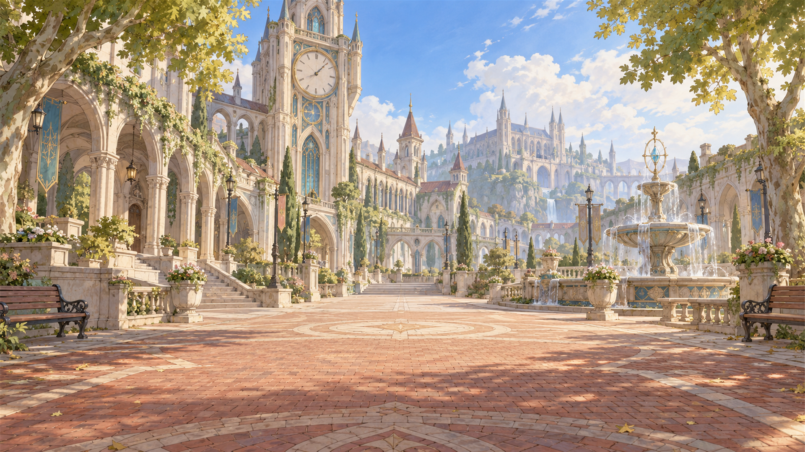 |
| `BG03_myroom1_day_1920x1080_012.png` | 사용자 지정 마이룸 낮 배경: 침대·책상·다이어리·가방·벽난로 |  |
| `BG04_academy_dormitory_1920x1080_013.png` | 학원 기숙사 배경 | 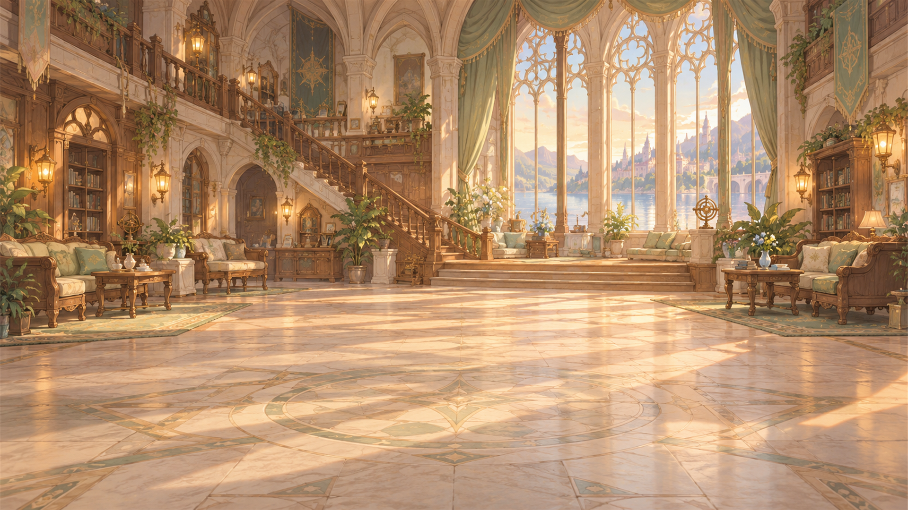 |
| `BG05_grand_library_1920x1080_014.png` | 대서고 배경 | 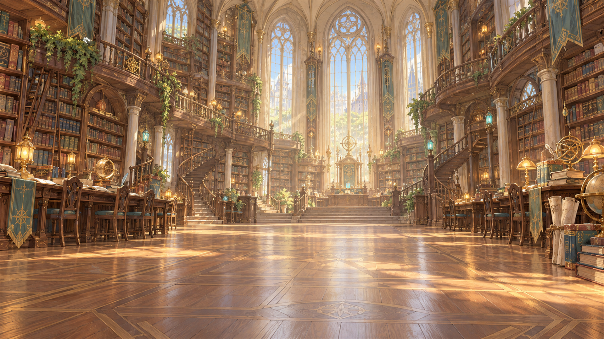 |
| `BG06_starlight_observatory_1920x1080_015.png` | 별빛 천문대 배경 | 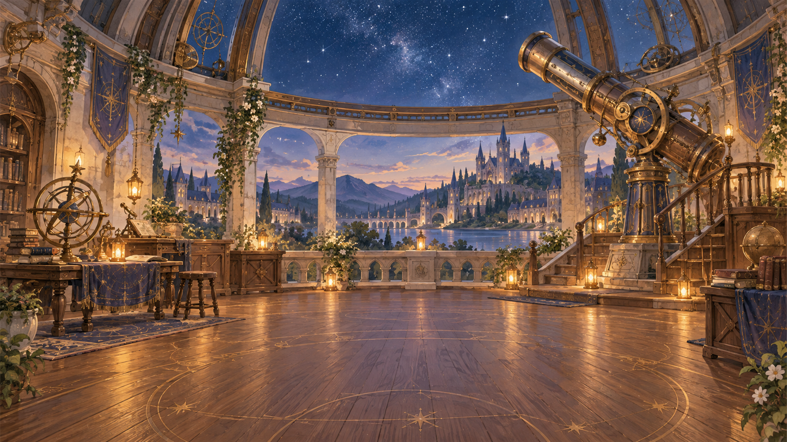 |
| `BG07_glass_greenhouse_1920x1080_016.png` | 유리 온실 배경 | 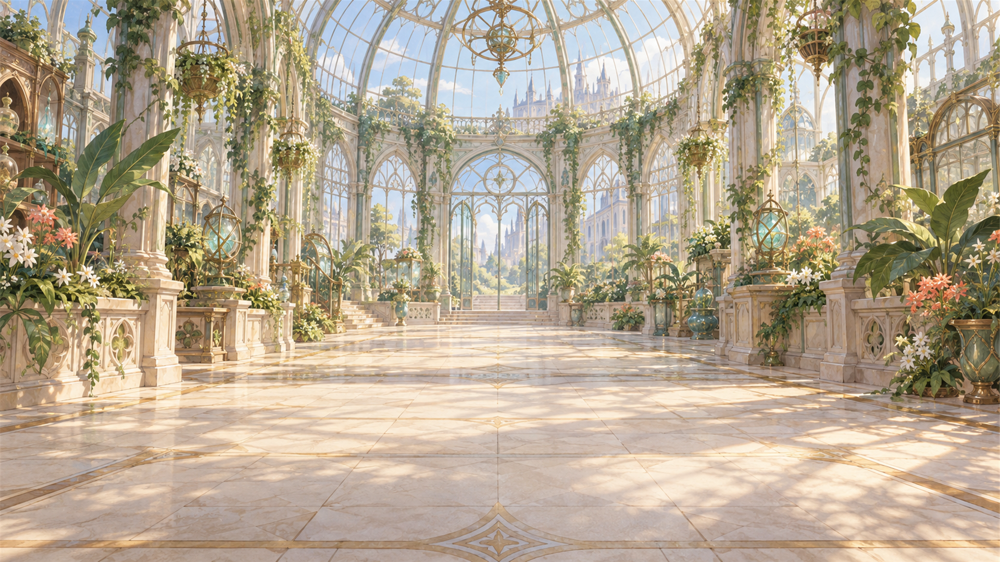 |
| `BG08_healing_herb_garden_1920x1080_017.png` | 치유의 약초원 배경 | 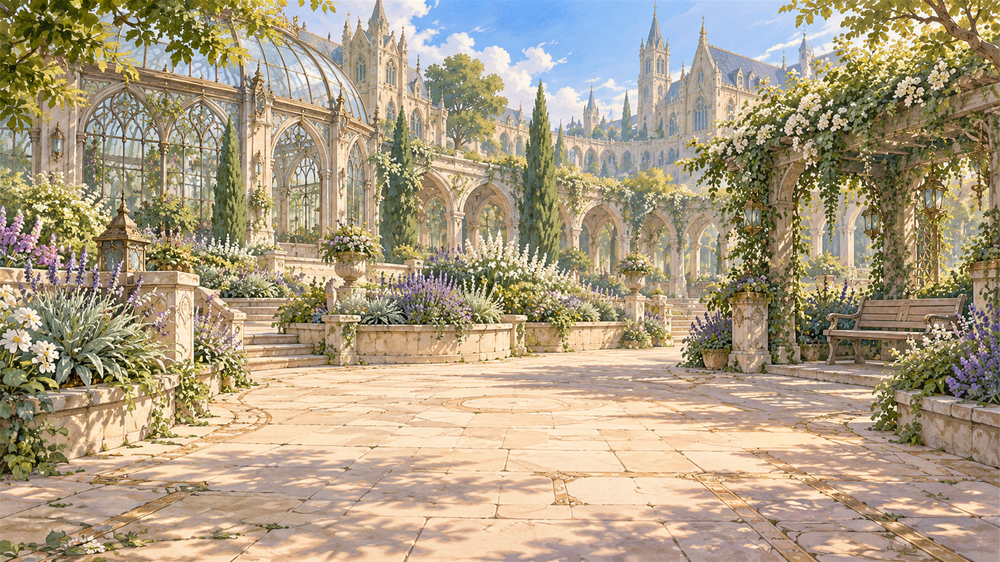 |
| `BG09_magic_workshop_1920x1080_018.png` | 마도 공방 배경 | 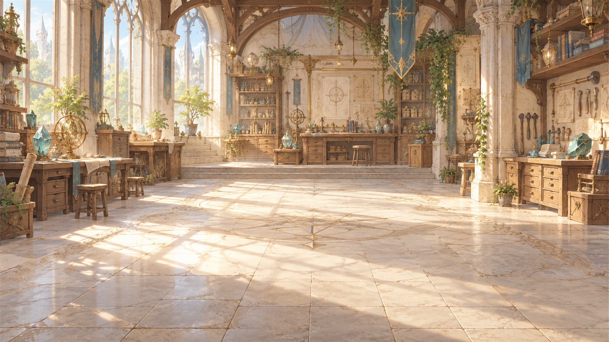 |
| `BG10_rune_training_ground_1920x1080_019.png` | 룬 수련장 배경 | 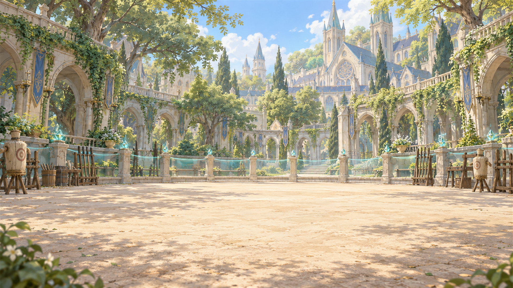 |
| `BG03_myroom1_sunset_1920x1080_021.png` | 승인된 마이룸 노을 배경 (1920×1080) | 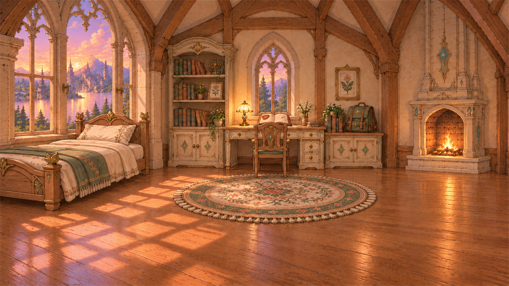 |
| `BG03_myroom1_night_1920x1080_022.png` | 승인된 마이룸 밤 배경 (1920×1080) | 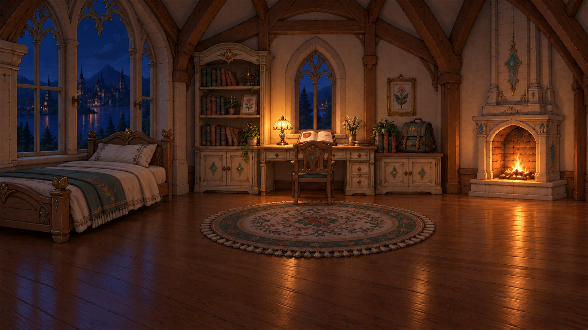 |
| `BG03_myroom2_day_1920x1080_023.png` | 마이룸 구도 02 · 낮 (1920×1080) | 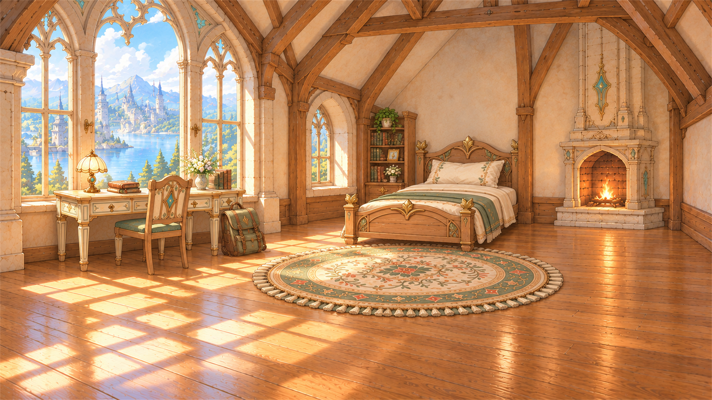 |
| `BG03_myroom2_sunset_1920x1080_024.png` | 마이룸 구도 02 · 노을 (1920×1080) | 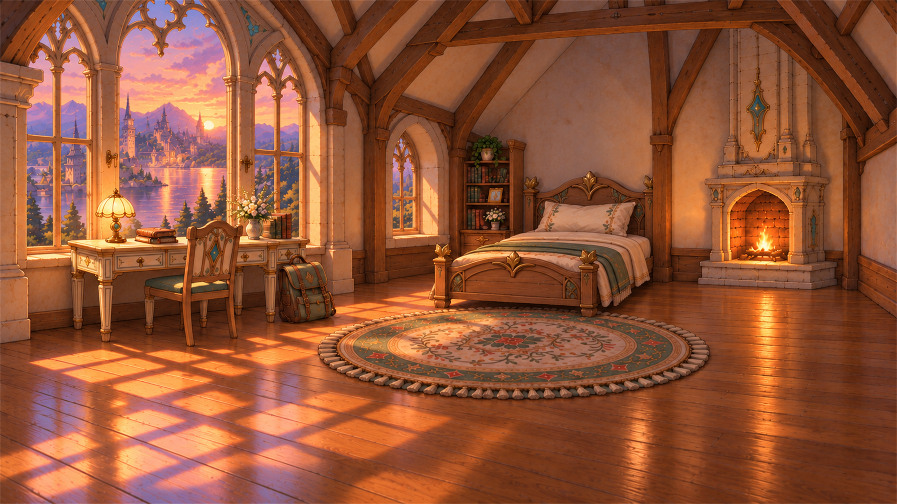 |
| `BG03_myroom2_night_1920x1080_025.png` | 마이룸 구도 02 · 밤 (1920×1080) | 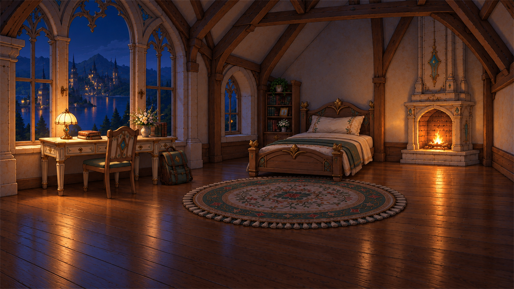 |

## 생성 원본 보관

게임 규격으로 가공하기 전 배경 10장과 마이룸 시안 생성 원본 1장은 `C:/Users/josep/Desktop/Final Project/asset/background`에 보관했습니다. 현재 폴더에는 가공본만 유지합니다. 이전 파일 이력은 Git 기록에 남아 있습니다. 기존 게임용 파일명과 번호는 연결 경로 보존을 위해 유지했습니다.

2026-10-10: BG03은 사용자 첨부 이미지로 교체했습니다. 구도 변경 없이 1920×1080으로 내보냈으며 원본은 로컬 background 폴더에 보관합니다. 낮·노을·밤 세 가지 모두 사용자 승인 후 게임용으로 저장했습니다. 원본은 로컬에만 별도 보관합니다.

마이룸 시간대: 낮 `_012`, 노을 `_021`, 밤 `_022`. 모두 1920×1080이며 같은 구도와 가구 배치를 유지합니다. 낮의 기존 파일명은 연결 경로 보존을 위해 유지했습니다.

2026-10-10: 두 번째 마이룸 구도는 `myroom2`로 구분합니다. 낮 `_023`, 노을 `_024`, 밤 `_025`; 기존 구도 파일은 보존합니다. 이 세트의 원본은 로컬 `asset/background`에 `myroom_layout02_*_source_025~027.png`로 보관했습니다. 다른 GitHub 폴더는 변경하지 않았습니다.

## 마이룸 구도 구분 (2026-10-10)

- `myroom1`: 왼쪽 침대, 중앙 책상과 펼친 다이어리, 오른쪽 수납장 위 가방. 낮 012 / 노을 021 / 밤 022.
- `myroom2`: 왼쪽 책상과 바닥 가방, 중앙 오른쪽 침대. 낮 023 / 노을 024 / 밤 025.
- 파일명 규칙: `BG03_myroom{1|2}_{day|sunset|night}_1920x1080_{기존번호}.png`. 기존 번호는 보존합니다.
- 첫 번째 낮 파일은 이름 변경 커밋에서 이미지 데이터가 줄바꿈 2바이트로 대체되어, 직전 정상 PNG 데이터로 복구했습니다. 나머지 5장은 이미지 데이터를 변경하지 않았습니다.

2026-10-10: 기존 마이룸 구도 검토 이미지 `SC01_myroom_complete_concept_020.png`를 제거했습니다. 마이룸 게임 배경은 `myroom1`과 `myroom2`의 낮·노을·밤 6장만 유지하며 생성 원본은 로컬에 보관합니다.
