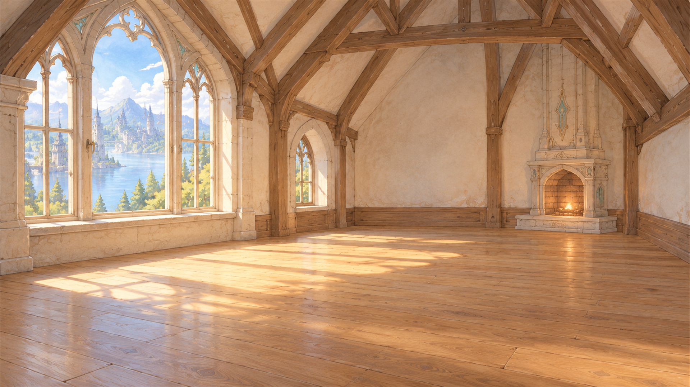

# 배경 이미지

현재 이 폴더의 PNG 10개를 나열합니다. 장소 역할은 [세계관 문서](../../document/02_WORLDVIEW.md)를 참고했습니다. 파일은 화면 적용 검수 완료를 뜻하지 않습니다. 새 이미지의 추가·삭제·교체 시 이 표도 갱신하세요.

| 파일 | 설명 | 미리보기 |
|---|---|---|
| `BG01_arcadia_entrance_and_lake_1920x1080_010.png` | 아르카디아 입구와 호수 배경 |  |
| `BG02_clocktower_plaza_1920x1080_011.png` | 시계탑 광장 배경 |  |
| `BG03_empty_myroom_1920x1080_012.png` | 빈 마이룸 배경 |  |
| `BG04_academy_dormitory_1920x1080_013.png` | 학원 기숙사 배경 |  |
| `BG05_grand_library_1920x1080_014.png` | 대서고 배경 |  |
| `BG06_starlight_observatory_1920x1080_015.png` | 별빛 천문대 배경 |  |
| `BG07_glass_greenhouse_1920x1080_016.png` | 유리 온실 배경 |  |
| `BG08_healing_herb_garden_1920x1080_017.png` | 치유의 약초원 배경 |  |
| `BG09_magic_workshop_1920x1080_018.png` | 마도 공방 배경 |  |
| `BG10_rune_training_ground_1920x1080_019.png` | 룬 수련장 배경 |  |
