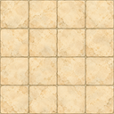
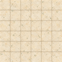
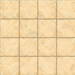
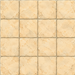
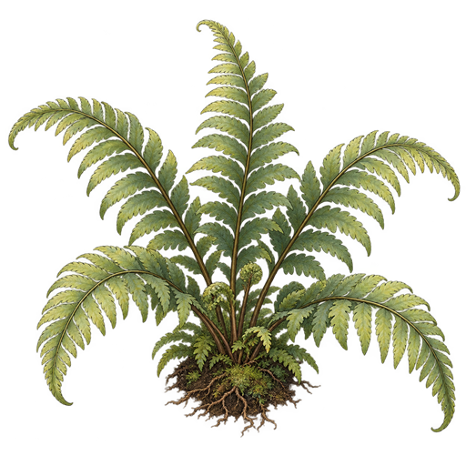
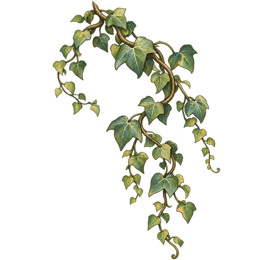
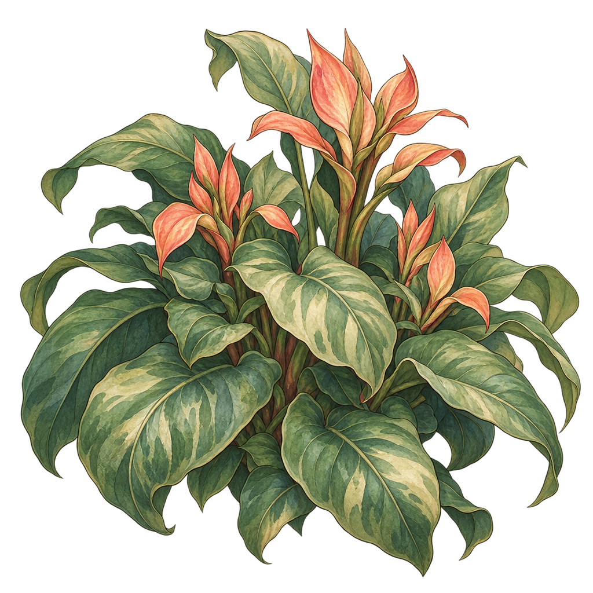
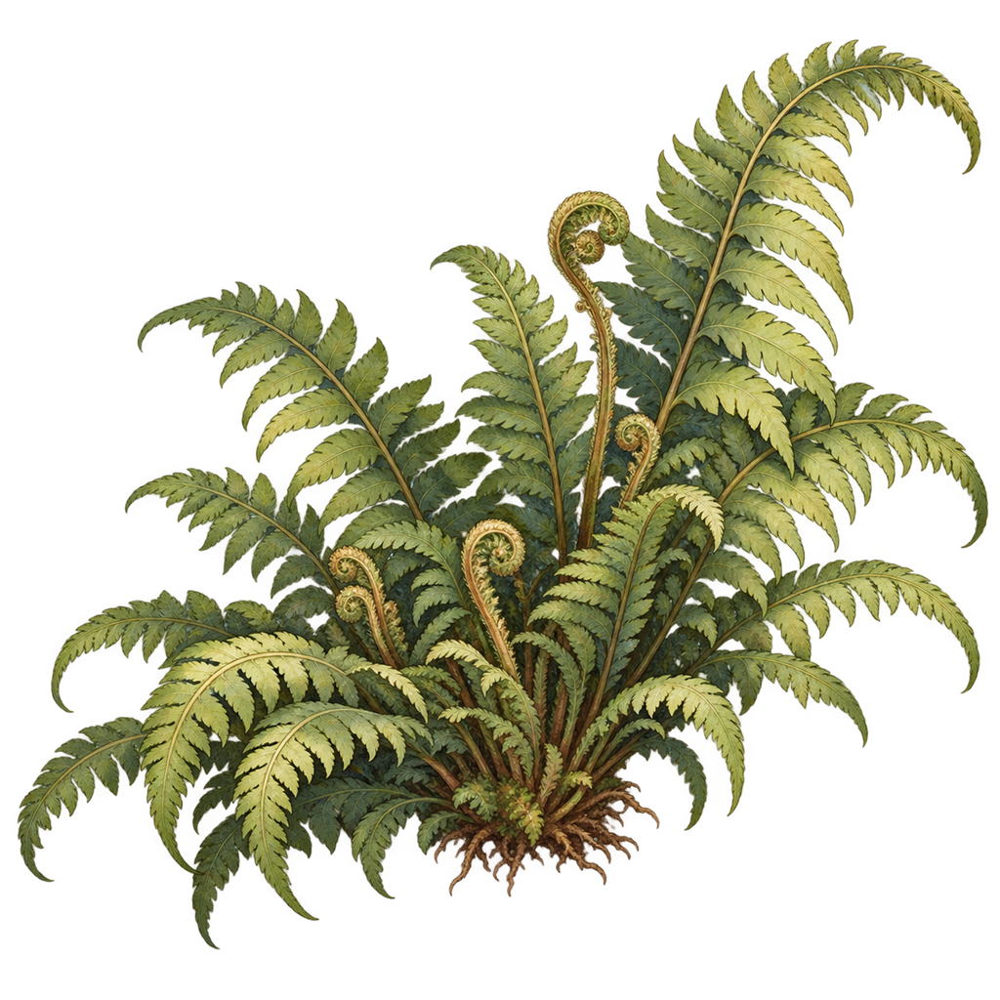

# 환경 이미지

현재 이 폴더의 PNG 15개입니다. 온실 바닥·식물·구조물의 여러 상태와 변형을 파일명대로 구분했습니다. 변형 중 어느 파일을 실제로 사용할지는 별도 선정이 필요합니다. 새 이미지의 추가·삭제·교체 시 이 표를 갱신하세요.

| 파일 | 설명 | 미리보기 |
|---|---|---|
| `ENV01_greenhouse_floor_base_000.png` | 온실 바닥 기본형 |  |
| `ENV02_greenhouse_floor_variant_A_001.png` | 온실 바닥 A 변형 |  |
| `ENV02_greenhouse_floor_variant_A_v2_002.png` | 온실 바닥 A의 v2 변형 |  |
| `ENV03_greenhouse_floor_variant_B_003.png` | 온실 바닥 B 변형 |  |
| `ENV03_greenhouse_floor_variant_B_v2_004.png` | 온실 바닥 B의 v2 변형 |  |
| `ENV04_greenhouse_boundary_005.png` | 온실 경계 요소 |  |
| `ENV05_small_plant_A_006.png` | 작은 식물 A |  |
| `ENV06_small_plant_B_007.png` | 작은 식물 B |  |
| `ENV07_large_plant_A_008.png` | 큰 식물 A |  |
| `ENV08_large_plant_B_009.png` | 큰 식물 B |  |
| `ENV09_greenhouse_flowerbed_010.png` | 온실 화단 요소 |  |
| `ENV10_greenhouse_vines_011.png` | 온실 덩굴 요소 |  |
| `ENV11_greenhouse_structure_012.png` | 온실 구조물 요소 |  |
| `ENV12_foreground_plant_A_013.png` | 전경 식물 A |  |
| `ENV13_foreground_plant_B_014.png` | 전경 식물 B |  |
