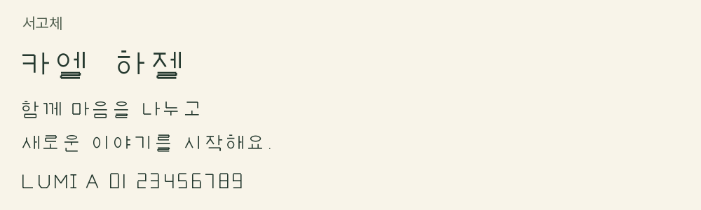
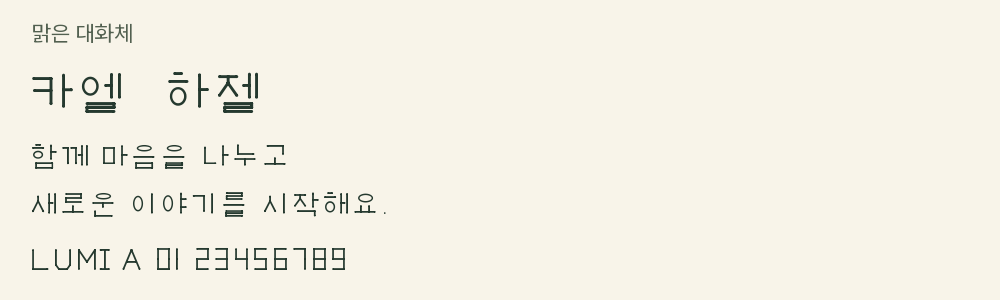
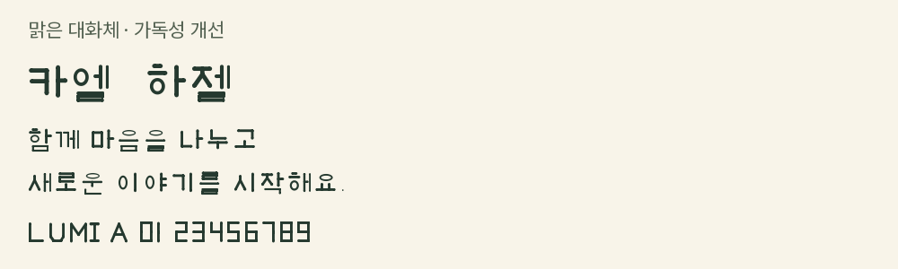
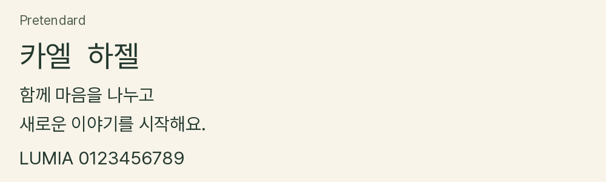
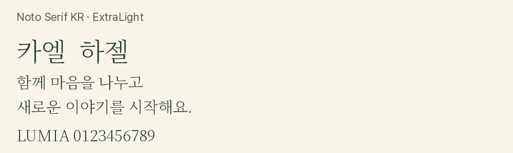
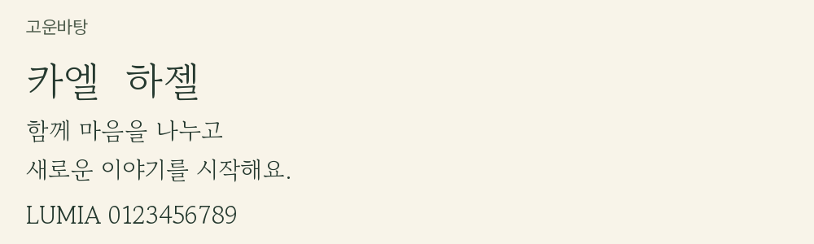

# 게임용 웹폰트

9종을 서체별 WOFF2 한 파일로 정리했습니다. 기본형과 가독성 개선형은 별도 버전입니다. 원본 TTF 8개는 로컬에 보관합니다. 미리보기는 previews 폴더에만 보관합니다.

| 서체 / 게임용 파일 | 미리보기 |
|---|---|
| 달빛명조 [lumia_moon_serif.woff2](./lumia_moon_serif.woff2) |  |
| 서고체 [lumia_archive.woff2](./lumia_archive.woff2) |  |
| 맑은 대화체 [lumia_clear_dialogue.woff2](./lumia_clear_dialogue.woff2) |  |
| 달빛명조 가독성 개선 [lumia_moon_readable.woff2](./lumia_moon_readable.woff2) |  |
| 서고체 가독성 개선 [lumia_archive_readable.woff2](./lumia_archive_readable.woff2) |  |
| 맑은 대화체 가독성 개선 [lumia_clear_readable.woff2](./lumia_clear_readable.woff2) |  |
| Pretendard [pretendard.woff2](./pretendard.woff2) |  |
| Noto Serif KR ExtraLight [noto_serif_kr.woff2](./noto_serif_kr.woff2) |  |
| 고운바탕 [gowun_batang.woff2](./gowun_batang.woff2) |  |

원본: `C:/Users/josep/Desktop/Final Project/asset/font_files/originals`. Noto와 고운바탕은 글자 범위를 줄이지 않고 WOFF2로 변환했습니다. 루미아 자체 서체 일부는 한글 글자 지원이 제한되어 있어 생/각/들/미 등이 누락됩니다. 미리보기는 지원되는 공통 문장을 사용했습니다. Noto는 저장된 ExtraLight 굵기를 유지합니다.

## 게임용 창조 룬폰트 — SVG 문자 디자인

번호 01~10의 독립 디자인 10종입니다. 각 파일은 1000×180 SVG이며 6개 문자 요소를 포함합니다. 일반 WOFF2 웹폰트와 달리 텍스트 입력으로 표시되는 폰트 파일은 아닙니다. 코드 포인트 U+05D0~U+05D5에 대응하는 요소 ID u05d0~u05d5를 사용하며 히브리어 글꼴 전체를 지원하는 것은 아닙니다. SVG 색상은 currentColor를 사용합니다. 외부 이미지로 표시할 때는 기본 색상이 적용되고 색 변경은 인라인 SVG에서 설정합니다.

| 번호 | 파일 | 미리보기 |
|---|---|---|
| 01 | [creative_rune_font01.svg](./creative_rune_font01.svg) |  |
| 02 | [creative_rune_font02.svg](./creative_rune_font02.svg) |  |
| 03 | [creative_rune_font03.svg](./creative_rune_font03.svg) |  |
| 04 | [creative_rune_font04.svg](./creative_rune_font04.svg) |  |
| 05 | [creative_rune_font05.svg](./creative_rune_font05.svg) |  |
| 06 | [creative_rune_font06.svg](./creative_rune_font06.svg) |  |
| 07 | [creative_rune_font07.svg](./creative_rune_font07.svg) |  |
| 08 | [creative_rune_font08.svg](./creative_rune_font08.svg) |  |
| 09 | [creative_rune_font09.svg](./creative_rune_font09.svg) |  |
| 10 | [creative_rune_font10.svg](./creative_rune_font10.svg) |  |

2026-10-10: 기존 rune 폴더를 제거하고 문자 디자인을 font_files에 통합했습니다. 기존 이름으로 중복 저장하지 않았습니다. 원본과 이전 README는 `C:/Users/josep/Desktop/Final Project/asset/font_files/rune_originals`에 보관했습니다.
