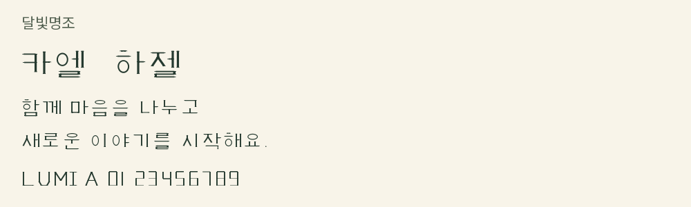
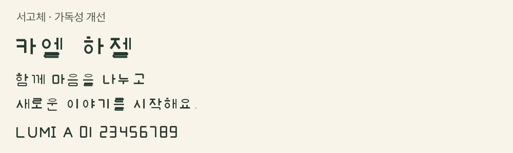
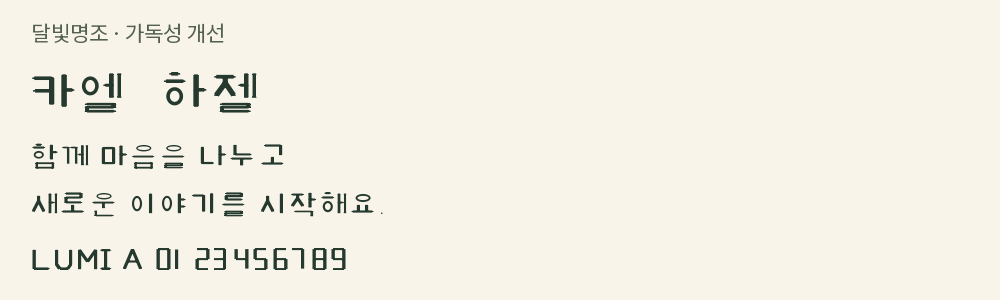

# 폰트 미리보기

저장된 실제 폰트 9종의 샘플입니다. 동일 서체의 TTF·WOFF2는 한 행에 묶었습니다. 이미지는 폰트 선택을 위한 미리보기이며 게임용 이미지 에셋이 아닙니다.

공통 샘플: 이름 50px, 대화 30px, 행 간격 48px. 폰트 기본 굵기를 사용했으며 인위적인 두께·자간 보정을 추가하지 않았습니다. GitHub 표시 크기는 실제 게임 화면과 다를 수 있습니다.

| 서체 / 파일 | 실제 서체 미리보기 |
|---|---|
| 달빛명조 [lumia_moon_serif_000.ttf](./lumia_moon_serif_000.ttf) [lumia_moon_serif_001.woff2](./lumia_moon_serif_001.woff2) |  |
| 서고체 [lumia_archive_002.ttf](./lumia_archive_002.ttf) [lumia_archive_003.woff2](./lumia_archive_003.woff2) |  |
| 맑은 대화체 [lumia_clear_dialogue_004.ttf](./lumia_clear_dialogue_004.ttf) [lumia_clear_dialogue_005.woff2](./lumia_clear_dialogue_005.woff2) |  |
| Pretendard [pretendard_006.woff2](./pretendard_006.woff2) |  |
| Noto Serif KR · ExtraLight [noto_serif_kr_007.ttf](./noto_serif_kr_007.ttf) |  |
| 고운바탕 [gowun_batang_008.ttf](./gowun_batang_008.ttf) |  |
| 서고체 · 가독성 개선 [readable_font_lumia_archive_readable_009.ttf](./readable_font_lumia_archive_readable_009.ttf) [readable_font_lumia_archive_readable_010.woff2](./readable_font_lumia_archive_readable_010.woff2) |  |
| 맑은 대화체 · 가독성 개선 [readable_font_lumia_clear_readable_011.ttf](./readable_font_lumia_clear_readable_011.ttf) [readable_font_lumia_clear_readable_012.woff2](./readable_font_lumia_clear_readable_012.woff2) |  |
| 달빛명조 · 가독성 개선 [readable_font_lumia_moon_readable_013.ttf](./readable_font_lumia_moon_readable_013.ttf) [readable_font_lumia_moon_readable_014.woff2](./readable_font_lumia_moon_readable_014.woff2) |  |

Noto Serif KR 파일은 저장된 ExtraLight 굵기를 그대로 보여줍니다. 이름·본문의 최종 가독성 판단은 게임 화면 크기에서 확인해야 합니다. 루미아 자체 서체 일부는 한글 글자 수가 제한되어 있어 생/각/들/미 등이 지원되지 않습니다. 미리보기는 모든 서체가 지원하는 공통 문장만 사용하고 대체 폰트는 사용하지 않았습니다. 원래 폰트 파일은 변경하지 않았습니다.
