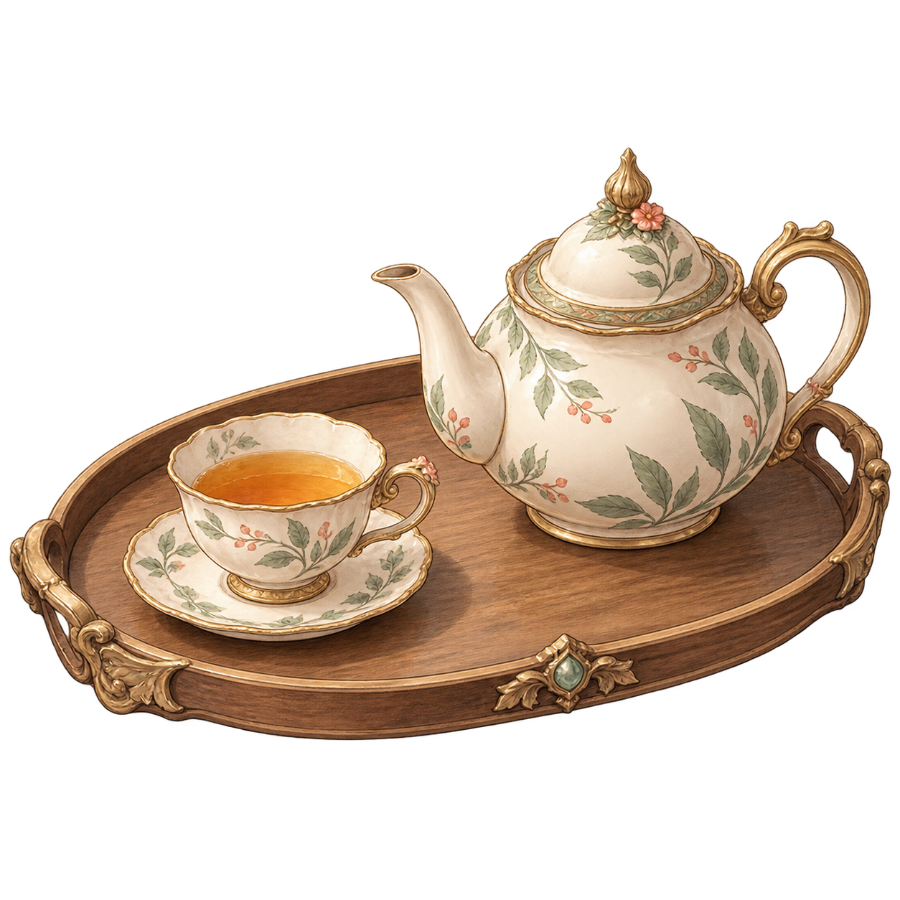
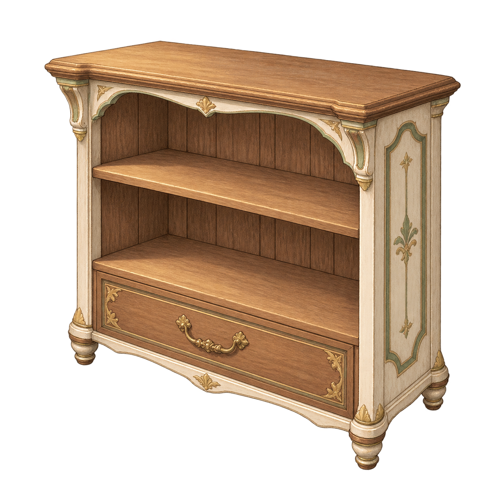
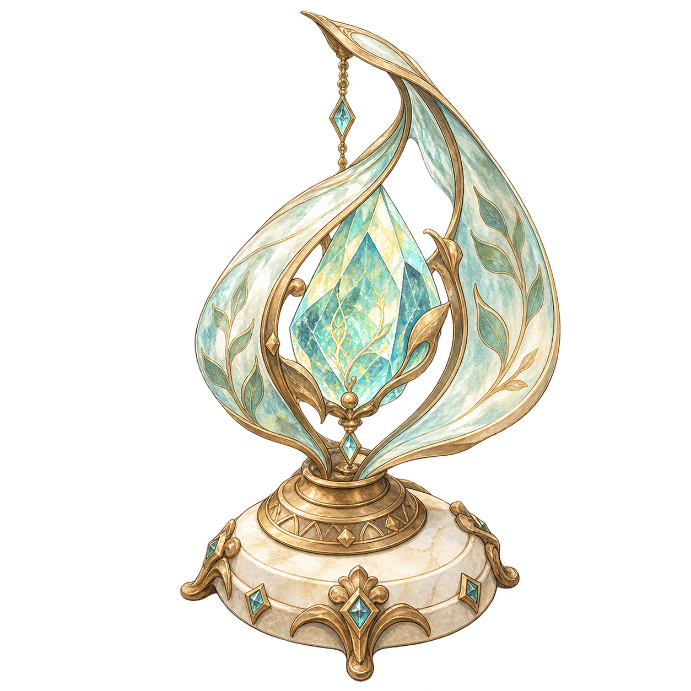
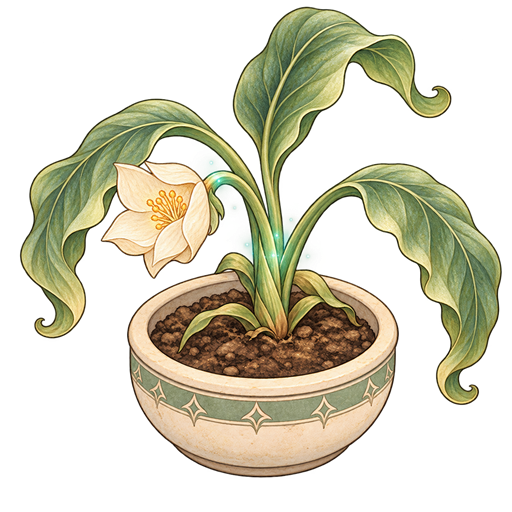
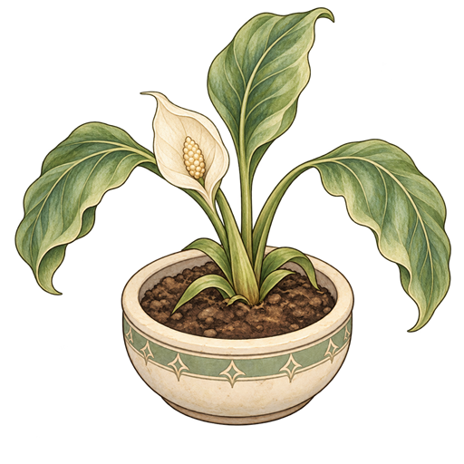

# 아이템·조사 오브젝트 이미지

현재 이 폴더의 PNG 26개입니다. `IT`는 소지품·가구·룬 물건, `OBJ`는 조사 장면의 상태별 오브젝트로 구분합니다. 용도와 이름은 [게임 콘텐츠](../../document/06_GAME_CONTENT.md) 및 [이미지 자원 설명](../../document/04_ASSETS.md)에 맞춰 간단히 적었습니다. 실제 사용 장면·변형 선정은 별도 확인이 필요합니다. 새 이미지의 추가·삭제·교체 시 이 표를 갱신하세요.

| 파일 | 설명 | 미리보기 |
|---|---|---|
| `IT01_heart_diary_000.png` | 마음 일기 이미지 |  |
| `IT02_rune_lamp_001.png` | 룬 램프 이미지 |  |
| `IT03_tea_set_002.png` | 차 세트 이미지 |  |
| `IT04_herb_pot_003.png` | 약초 화분 이미지 |  |
| `IT05_rune_fragment_004.png` | 룬 조각 이미지 |  |
| `IT06_memory_frame_005.png` | 추억 액자 이미지 |  |
| `IT07_myroom_desk_006.png` | 마이룸 책상 이미지 |  |
| `IT08_myroom_chair_007.png` | 마이룸 의자 이미지 |  |
| `IT09_myroom_bed_008.png` | 마이룸 침대 이미지 |  |
| `IT10_myroom_bookshelf_009.png` | 마이룸 책장 이미지 |  |
| `IT11_myroom_rug_010.png` | 마이룸 러그 이미지 |  |
| `IT12_rune_ornament_011.png` | 룬 장식품 이미지 |  |
| `IT13_rune_ancient_book_012.png` | 룬 고서 이미지 |  |
| `IT14_parchment_letter_013.png` | 양피지 편지 이미지 |  |
| `IT15_magic_stone_workshop_tools_014.png` | 마석 공방 도구 이미지 |  |
| `IT16_practice_wooden_sword_015.png` | 수련용 목검 이미지 |  |
| `IT17_workshop_magic_stone_016.png` | 공방 마석 이미지 |  |
| `IT18_heart_rune_017.png` | 마음 룬 이미지 |  |
| `IT19_shadow_rune_018.png` | 그림자 룬 이미지 |  |
| `IT20_purified_rune_019.png` | 정화된 룬 이미지 |  |
| `OBJ01_inspect_plant_wilted_020.png` | 조사 식물의 시든 상태 |  |
| `OBJ02_inspect_plant_restored_021.png` | 조사 식물의 회복 상태 |  |
| `OBJ02_inspect_plant_restored_v2_022.png` | 회복 식물의 v2 변형; 사용본 미정 |  |
| `OBJ03_moonlight_herb_023.png` | 달빛 약초 조사 오브젝트 |  |
| `OBJ04_event_rune_inactive_024.png` | 이벤트 룬 비활성 상태 |  |
| `OBJ05_event_rune_active_025.png` | 이벤트 룬 활성 상태 |  |
