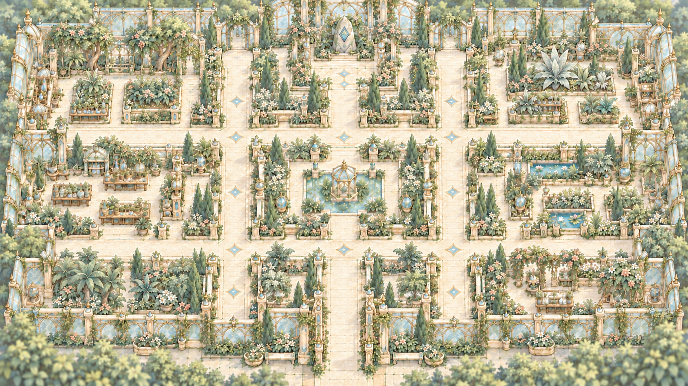
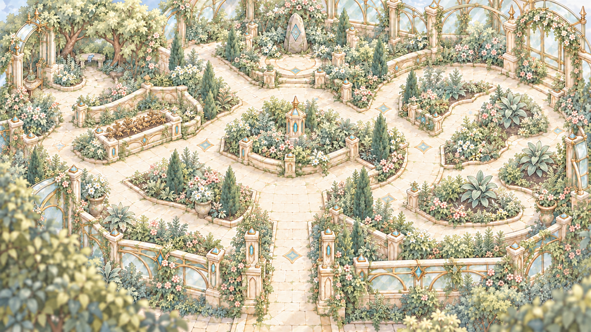

# 온실 어드벤처 전체맵

곡선 전체맵과 직선 전체맵 두 장만 게임 규격으로 유지합니다. 온실 배경의 밝은 아이보리·옅은 회녹색 세이지·절제된 금색에 맞춰 색감을 통일했습니다.

| 파일 | 용도 | 규격 | 미리보기 |
|---|---|---|---|
| [map1_straight.png](./map1_straight.png) | 직선 전체맵 | 1920×1080 |  |
| [map2_curved.png](./map2_curved.png) | 곡선 전체맵 | 1920×1080 |  |

## 로컬 보관

`C:/Users/josep/Desktop/Final Project/asset/map`

- `originals`: 원본 2개와 밝은 색감 수정본의 생성 원본 2개.
- `previous_versions`: 기존 전체맵·플레이·백팩·직선맵 6개.
- `map_archive_000.md`: 기존 파일 복사 검증 기록.

2026-10-10: 초기 MAP01~MAP03 및 이전 맵 파일을 GitHub에서 제거하고 두 전체맵만 유지했습니다. 두 맵 모두 기존 구조를 유지하고 SD 캐릭터가 배경에 묻히지 않도록 식물 채도와 그림자 대비를 낮춰 색감을 수정했습니다. 입구 상부 아치 연결부를 제거하고 양쪽 기둥만 유지했습니다. SD 캐릭터·UI·경로 표시가 없는 전체맵입니다. 이 PNG는 합쳐진 전체맵 이미지로, 이동 충돌·앞뒤 가림용 레이어나 타일 데이터는 포함하지 않습니다.
