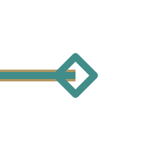
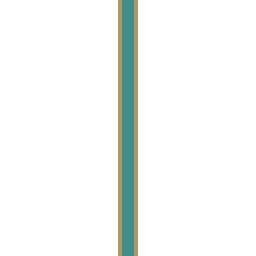
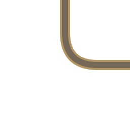

# 게임용 퍼즐 에셋

256×256 기준 게임용 에셋 9개만 유지합니다. 타일 바탕은 투명 PNG이며 연결선·시작·목표는 확대 가능한 SVG입니다. 활성과 비활성은 게임 상태가 다르므로 각각 유지합니다. 이미지 내용·색상·규격은 변경하지 않았습니다.

| 파일 | 용도 | 규격 | 미리보기 |
|---|---|---|---|
| [tile0_base.png](./tile0_base.png) | 타일 바탕 | 256×256 |  |
| [start1_inactive.svg](./start1_inactive.svg) | 시작 비활성 | 256×256 |  |
| [start2_active.svg](./start2_active.svg) | 시작 활성 | 256×256 |  |
| [goal1_inactive.svg](./goal1_inactive.svg) | 목표 비활성 | 256×256 |  |
| [goal2_active.svg](./goal2_active.svg) | 목표 활성 | 256×256 |  |
| [straight1_inactive.svg](./straight1_inactive.svg) | 직선 비활성 | 256×256 |  |
| [straight2_active.svg](./straight2_active.svg) | 직선 활성 | 256×256 |  |
| [corner1_inactive.svg](./corner1_inactive.svg) | 꺾임 비활성 | 256×256 |  |
| [corner2_active.svg](./corner2_active.svg) | 꺾임 활성 | 256×256 |  |

파일 번호: 바탕 0, 상태별 비활성 1 / 활성 2. 원본 1개(1254×1254)는 `C:/Users/josep/Desktop/Final Project/asset/puzzle/originals`에 보관하고 내용 일치를 확인했습니다. GitHub에는 원본·옛 파일명·중복 사본을 남기지 않았습니다. 실제 퍼즐 규칙 및 화면 적용 검수는 별도입니다.
