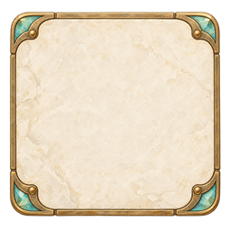
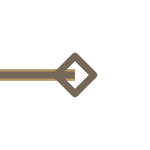
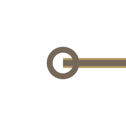
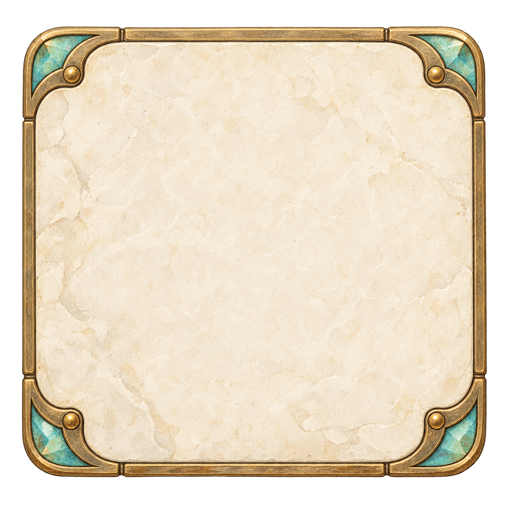

# 퍼즐 이미지

현재 이 폴더의 PNG/SVG 9개입니다. SVG는 시작·목표·직선·굽은 연결선의 활성/비활성 상태를 구분합니다. 실제 퍼즐 규칙과 화면 가독성은 별도 확인이 필요합니다. 새 이미지의 추가·삭제·교체 시 이 표를 갱신하세요.

| 파일 | 설명 | 미리보기 |
|---|---|---|
| `PZ01_puzzle_tile_base_000.png` | 퍼즐 타일 바탕 |  |
| `PZ_elbow_active_001.svg` | 굽은 연결선 활성 상태 |  |
| `PZ_elbow_inactive_002.svg` | 굽은 연결선 비활성 상태 |  |
| `PZ_goal_active_003.svg` | 목표 지점 활성 상태 |  |
| `PZ_goal_inactive_004.svg` | 목표 지점 비활성 상태 |  |
| `PZ_start_active_005.svg` | 시작 지점 활성 상태 |  |
| `PZ_start_inactive_006.svg` | 시작 지점 비활성 상태 |  |
| `PZ_straight_active_007.svg` | 직선 연결선 활성 상태 |  |
| `PZ_straight_inactive_008.svg` | 직선 연결선 비활성 상태 |  |

## 파일 미리보기

| 파일명 | 미리보기 |
|---|---|
| [PZ01_puzzle_tile_base_source_009.png](./PZ01_puzzle_tile_base_source_009.png) |  |
