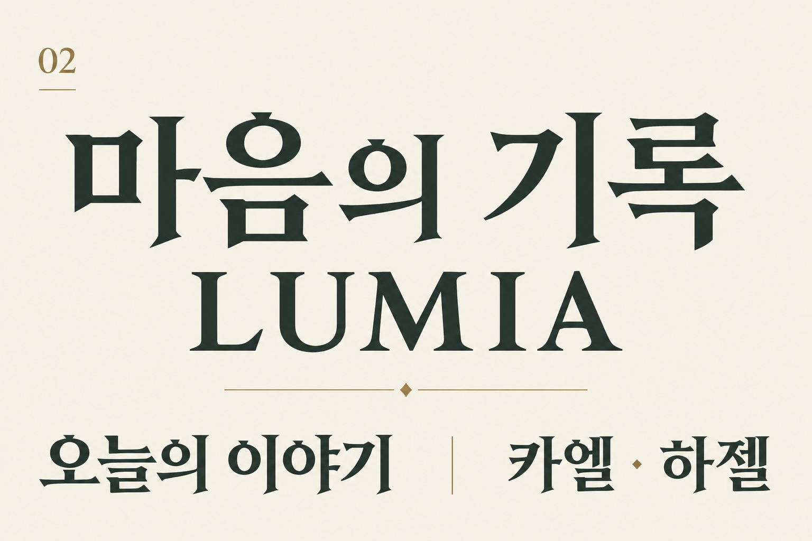
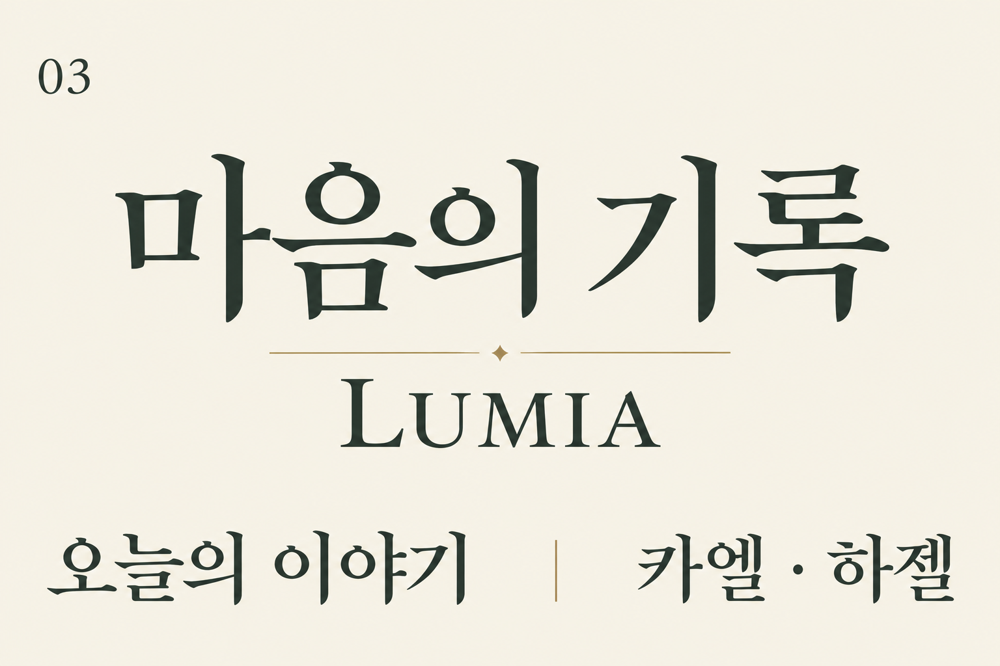
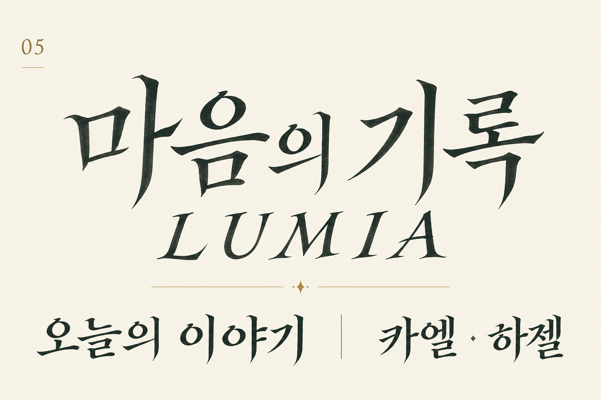
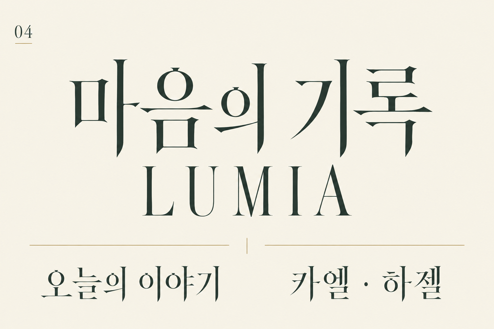
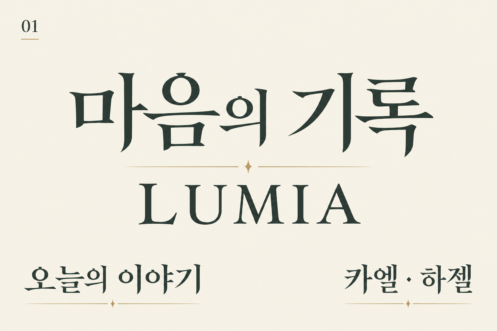

# typography 이미지

현재 폴더에 저장된 파일 미리보기입니다. 원본·시안 등의 구분은 파일명과 기존 제작 기록을 따릅니다. 이미지 존재가 최종 게임 적용 승인을 의미하지 않습니다.

## 파일 미리보기

| 파일명 | 미리보기 |
|---|---|
| [mature_type_inscription_serif_000.png](./mature_type_inscription_serif_000.png) |  |
| [mature_type_literary_serif_001.png](./mature_type_literary_serif_001.png) |  |
| [mature_type_manuscript_serif_002.png](./mature_type_manuscript_serif_002.png) |  |
| [mature_type_moonlit_serif_003.png](./mature_type_moonlit_serif_003.png) |  |
| [mature_type_scholarly_serif_004.png](./mature_type_scholarly_serif_004.png) |  |
