# UI 이미지

현재 이 폴더의 PNG/SVG 12개입니다. 배경·프레임·아이콘·로고는 동적 텍스트나 실제 UI 동작과 구분합니다. 로고 변형 중 최종 사용본은 미정입니다. 새 이미지의 추가·삭제·교체 시 이 표를 갱신하세요.

| 파일 | 설명 | 미리보기 |
|---|---|---|
| `UI01_parchment_tile_000.png` | 양피지 질감 타일 |  |
| `UI02_frame_corner_001.png` | UI 프레임 모서리 재료 | 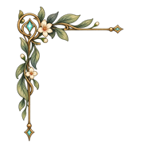 |
| `UI03_character_card_background_002.png` | 캐릭터 카드 배경 |  |
| `UI04_fullbody_preview_background_003.png` | 전신 미리보기 배경 |  |
| `UI07_admission_invitation_004.png` | 입학 초대장 이미지 재료 |  |
| `UI08_bag_005.svg` | 가방 아이콘 |  |
| `UI09_discovery_journal_006.svg` | 발견 기록 아이콘 |  |
| `UI10_hint_007.svg` | 힌트 아이콘 |  |
| `dialogue_frame_013.png` | 일반 대화창 프레임 | 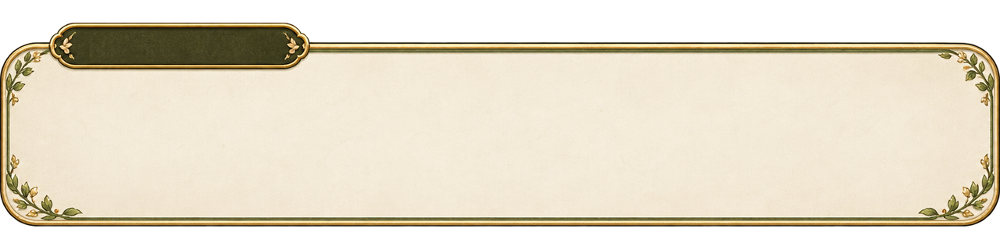 |
| `lumia_logo_mystic_01_017.png` | LUMIA 신비 로고 1안 | 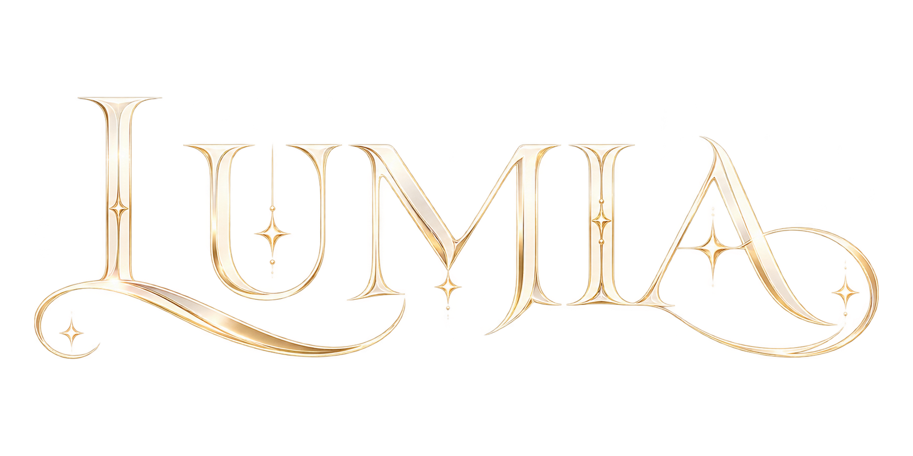 |
| `lumia_logo_mystic_05_018.png` | LUMIA 신비 로고 5안 | 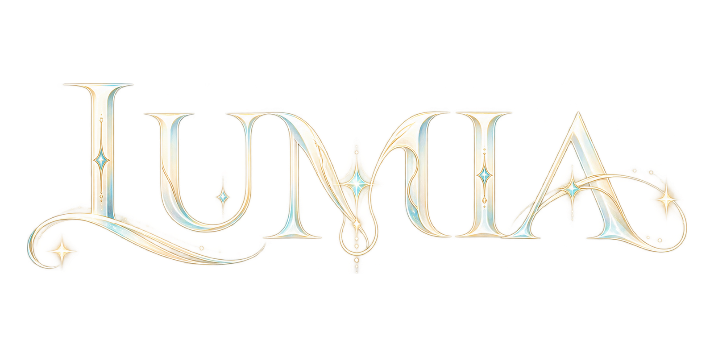 |
| `reference_card_title_014.png` | 제목 영역이 있는 참조 카드 | 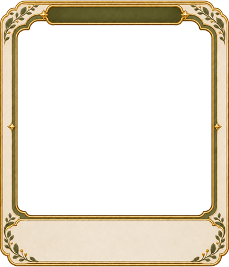 |

## 파일 미리보기

| 파일명 | 미리보기 |
|---|---|
| [UI01_parchment_tile_source_008.png](./UI01_parchment_tile_source_008.png) |  |
| [UI02_frame_corner_source_009.png](./UI02_frame_corner_source_009.png) | 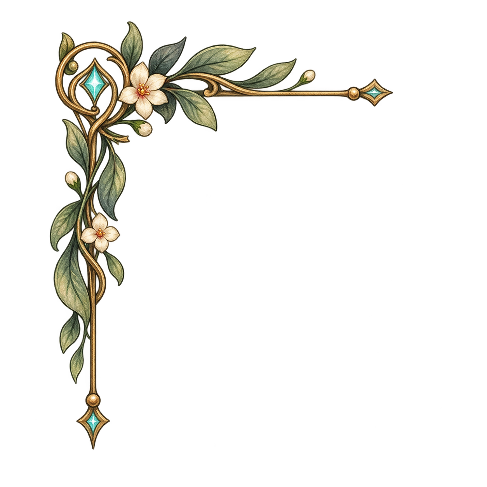 |
| [UI03_character_card_background_source_010.png](./UI03_character_card_background_source_010.png) | 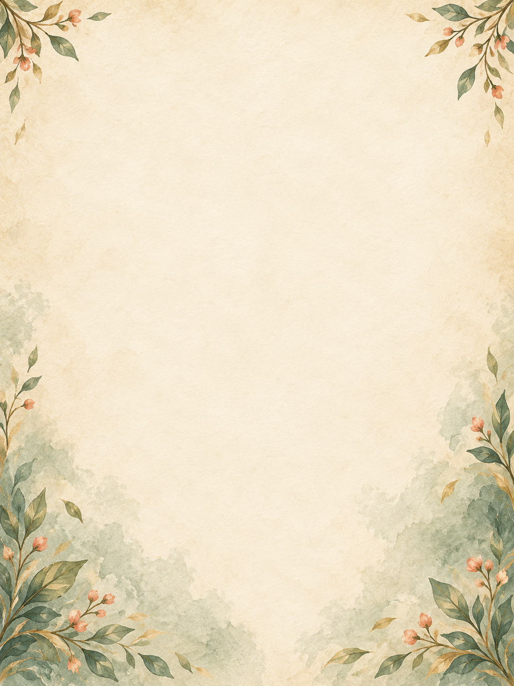 |
| [UI04_fullbody_preview_background_source_011.png](./UI04_fullbody_preview_background_source_011.png) | 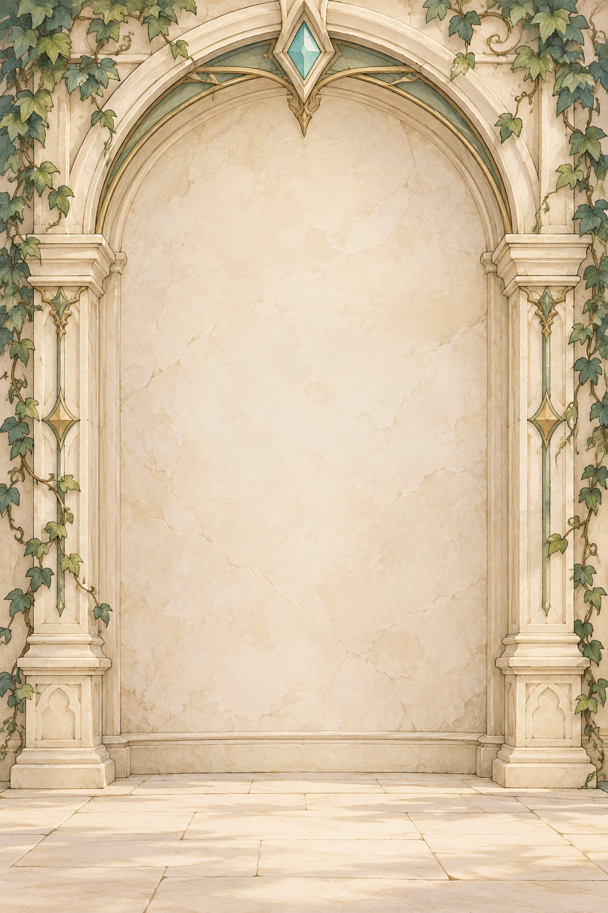 |
| [UI07_admission_invitation_source_012.png](./UI07_admission_invitation_source_012.png) | 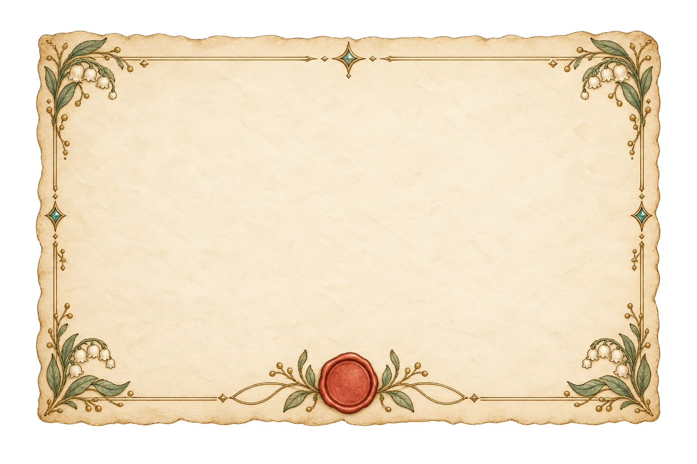 |
| [journal_button_icon_019.svg](./journal_button_icon_019.svg) |  |
| [journal_button_icon_020.svg](./journal_button_icon_020.svg) |  |
| [journal_button_icon_021.svg](./journal_button_icon_021.svg) |  |
| [journal_button_icon_022.svg](./journal_button_icon_022.svg) |  |
| [journal_button_icon_023.svg](./journal_button_icon_023.svg) |  |
| [player_status_frame_015.png](./player_status_frame_015.png) | 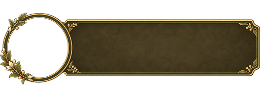 |
| [relationship_status_frame_016.png](./relationship_status_frame_016.png) | 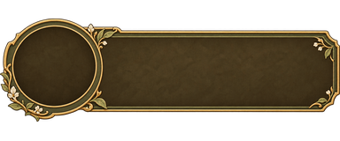 |
| [title_layout_dialogue_title_layout_024.svg](./title_layout_dialogue_title_layout_024.svg) | 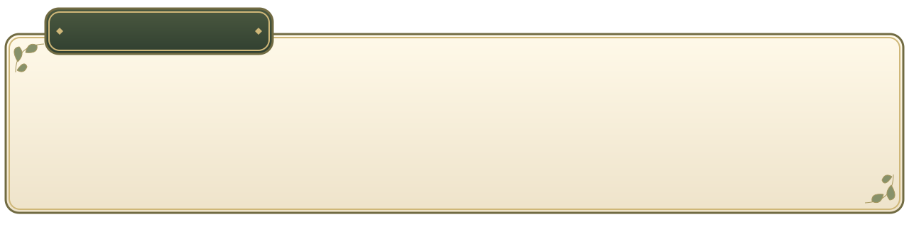 |
| [title_layout_dialogue_title_layout_025.svg](./title_layout_dialogue_title_layout_025.svg) |  |
| [title_layout_dialogue_title_layout_026.svg](./title_layout_dialogue_title_layout_026.svg) | 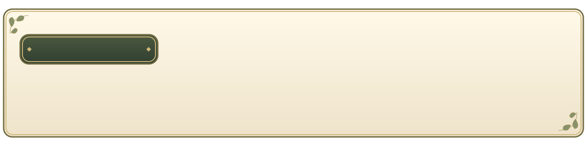 |
| [title_layout_dialogue_title_layout_027.svg](./title_layout_dialogue_title_layout_027.svg) | 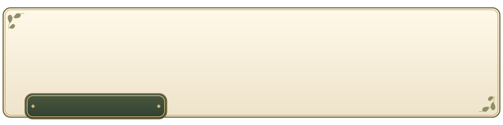 |
| [title_layout_dialogue_title_layout_028.svg](./title_layout_dialogue_title_layout_028.svg) | 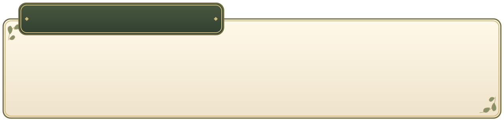 |
| [title_layout_reference_title_layout_029.svg](./title_layout_reference_title_layout_029.svg) | 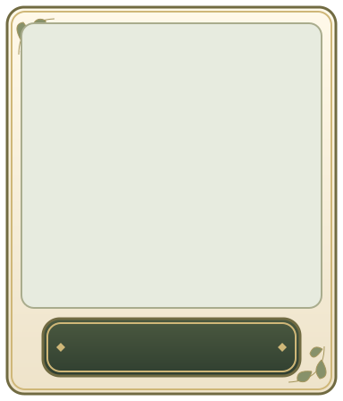 |
| [title_layout_reference_title_layout_030.svg](./title_layout_reference_title_layout_030.svg) | 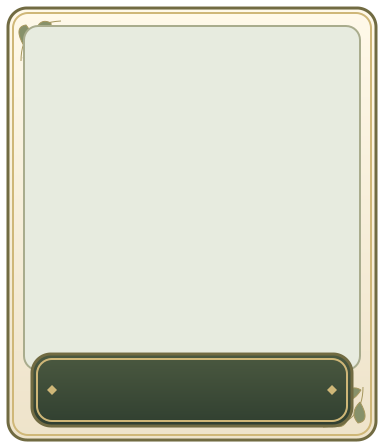 |
| [title_layout_reference_title_layout_031.svg](./title_layout_reference_title_layout_031.svg) | 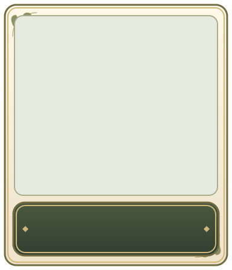 |
| [title_layout_reference_title_layout_032.svg](./title_layout_reference_title_layout_032.svg) | 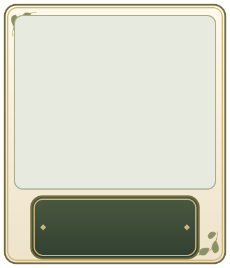 |
| [title_layout_reference_title_layout_033.svg](./title_layout_reference_title_layout_033.svg) | 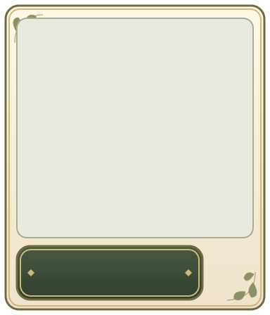 |
