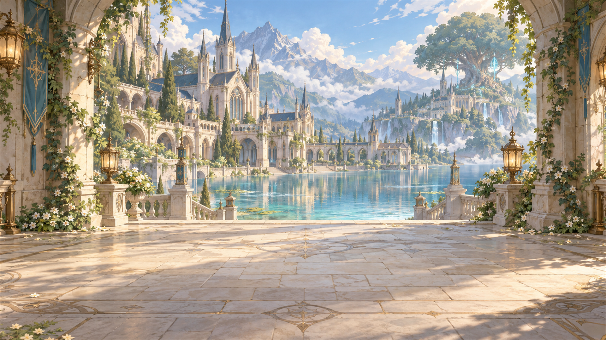

# 세계관: 룬과 아르카디아

## 핵심 법칙

아르카디아의 룬은 단순한 전투 마법이나 점수 장치가 아닙니다. 오래된 룬은 사람의 진실한 마음과 의지에 반응합니다. 불안, 시기, 외로움, 오해와 단절이 쌓이면 빛을 잃은 그림자 룬과 세계의 이상 현상으로 드러날 수 있습니다. 문제 해결은 그림자 룬을 적으로 처치하는 것이 아니라 `징후 관찰 → 사연 탐색·경청 → 이해 → 행동과 선택 → 세계의 변화`로 표현합니다.

## 배경과 분위기

주 무대는 호수와 숲에 둘러싸인 룬 학원 마을 **아르카디아**입니다. 고풍스러운 석조 건물, 벽돌길, 고서, 양피지, 온실과 식물이 만드는 서정적이고 따뜻한 클래식 판타지 분위기를 지향합니다. 학생들은 기숙 생활을 하며 수업·연구·교류를 통해 갈등과 회복을 경험합니다.

## 주요 장소

| 장소 | 이야기·게임에서의 역할 | 이미지 |
|---|---|---|
| 학원 입구와 호수 | 아르카디아 첫인상 | [보기](../asset/background/BG01_arcadia_entrance_and_lake_1920x1080_010.png) |
| 시계탑 광장 | 사람, 일상, 사건의 출발점 | [보기](../asset/background/BG02_clocktower_plaza_1920x1080_011.png) |
| 기숙사와 마이룸 | 학생들의 일상; 개인 안식처·기록 | [보기](../asset/background/BG03_empty_myroom_1920x1080_012.png) |
| 대서고 | 역사와 지식, 단서 | [보기](../asset/background/BG05_grand_library_1920x1080_014.png) |
| 별빛 천문대 | 세계의 변화와 이상 현상 관측 | [보기](../asset/background/BG06_starlight_observatory_1920x1080_015.png) |
| 유리 온실·약초원 | 식물, 관계, 감정, 채집 | [보기](../asset/background/BG07_glass_greenhouse_1920x1080_016.png) |
| 마도 공방 | 수리와 도구 제작을 통한 실천적 해결 | [보기](../asset/background/BG09_magic_workshop_1920x1080_018.png) |
| 수련장 | 안전한 조작·기술 연습 | [보기](../asset/background/BG10_rune_training_ground_1920x1080_019.png) |

장소 이미지는 분위기와 공간 구성을 이해하기 위한 자료이며, 실제 화면 크롭·배치·합성 검수까지 완료했다는 뜻은 아닙니다. 기숙사·약초원의 별도 이미지는 [배경 폴더](../asset/background/)에서 확인할 수 있습니다.

## 이야기 작성 원칙

인물의 상처나 성향을 선악으로 분류하지 않습니다. 플레이어가 직접 관찰하거나 대화해야 알 수 있는 답을 안내 인물이 먼저 말하지 않도록 합니다. 선택 후에는 설명 문구만 띄우기보다 인물·룬·환경에 변화를 남깁니다.

출처: [초기 세계관](../lagacy/document/02_worldview.md), [현재 통합 기획의 세계관·공간](../lagacy/docs/LUMIA_GAME_DESIGN.md).
