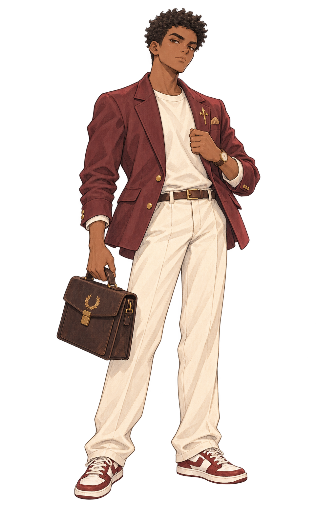
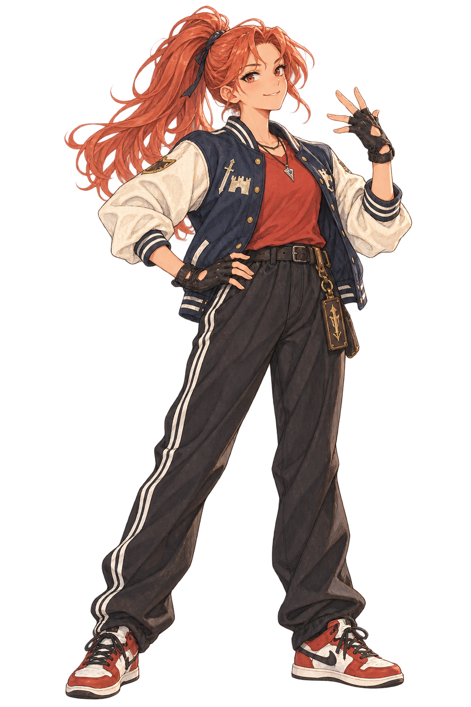
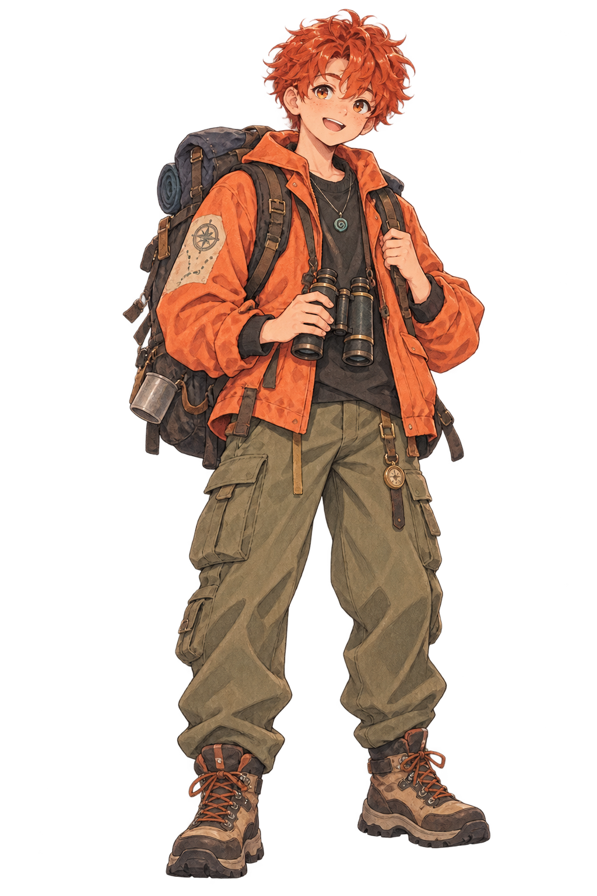
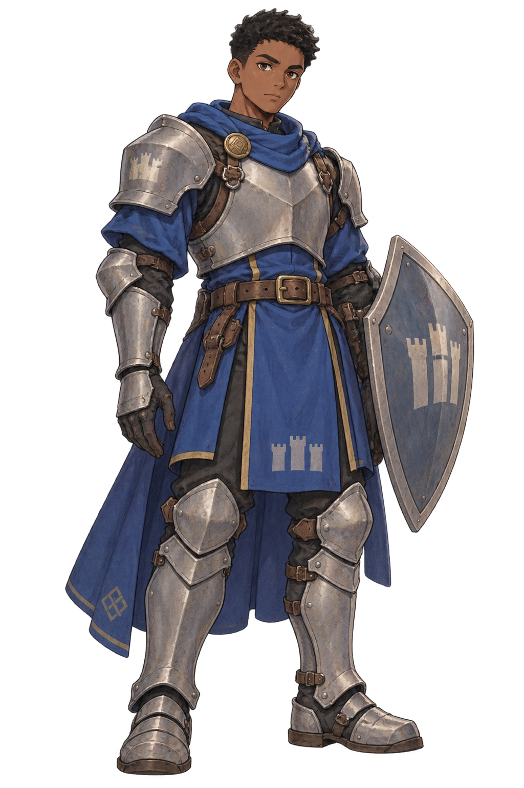
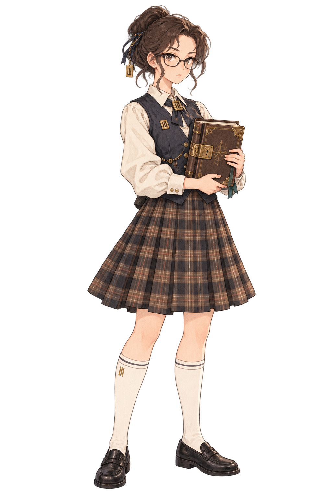
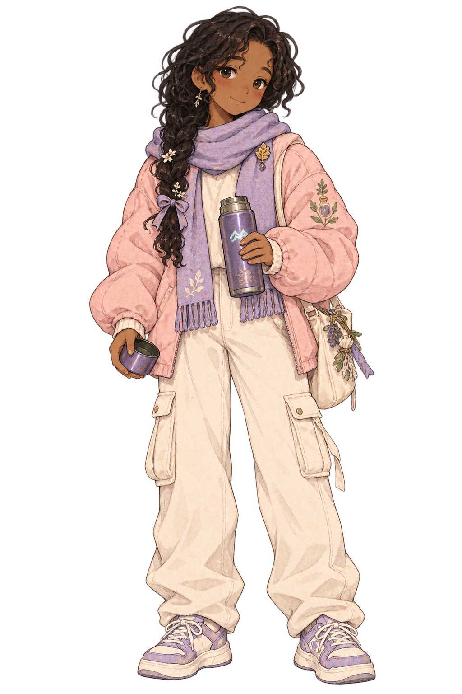
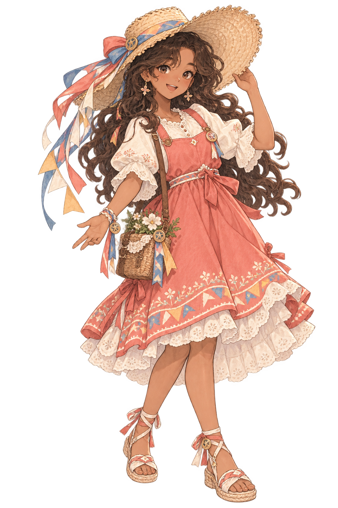
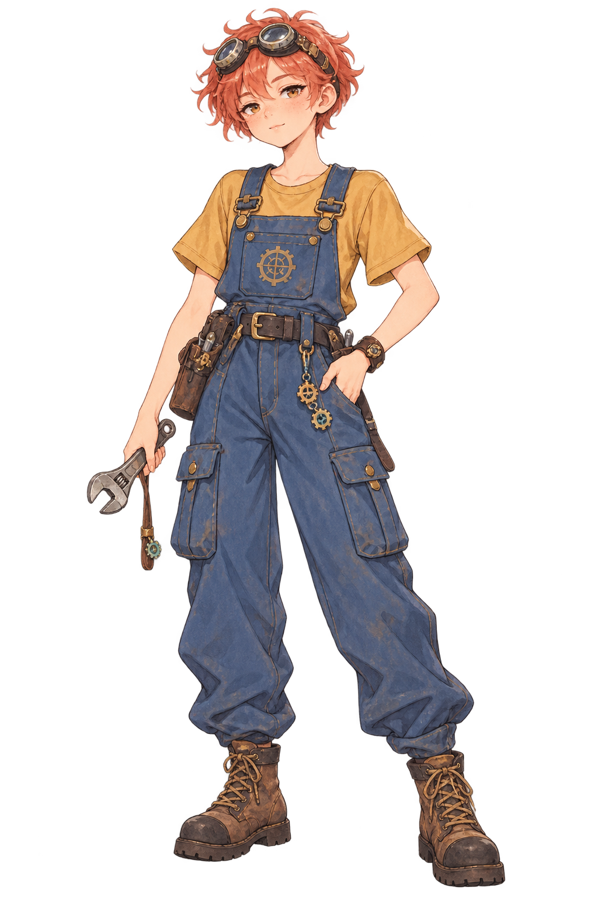
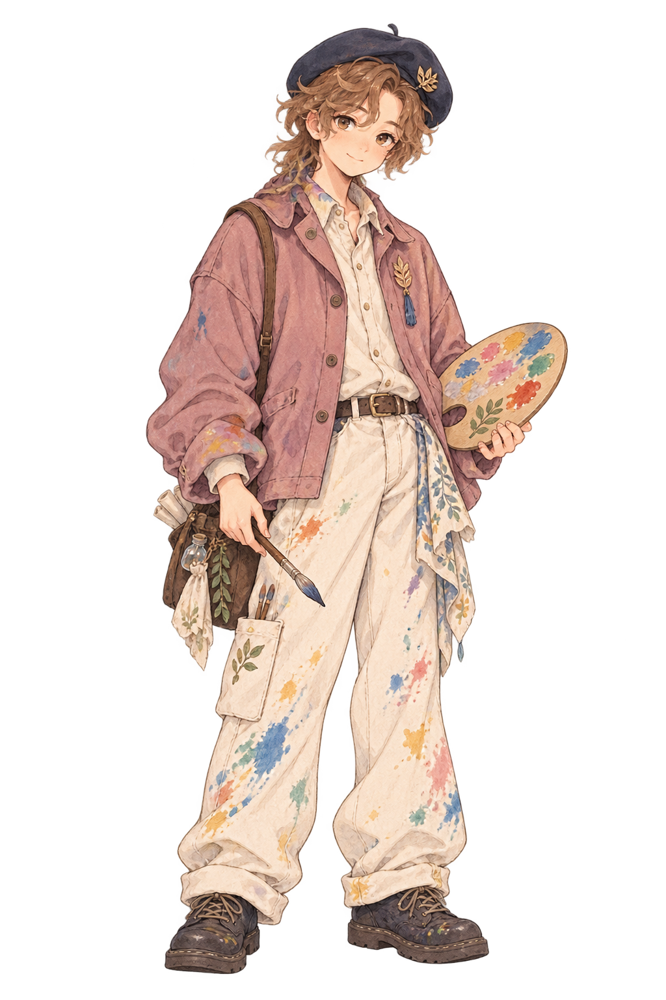
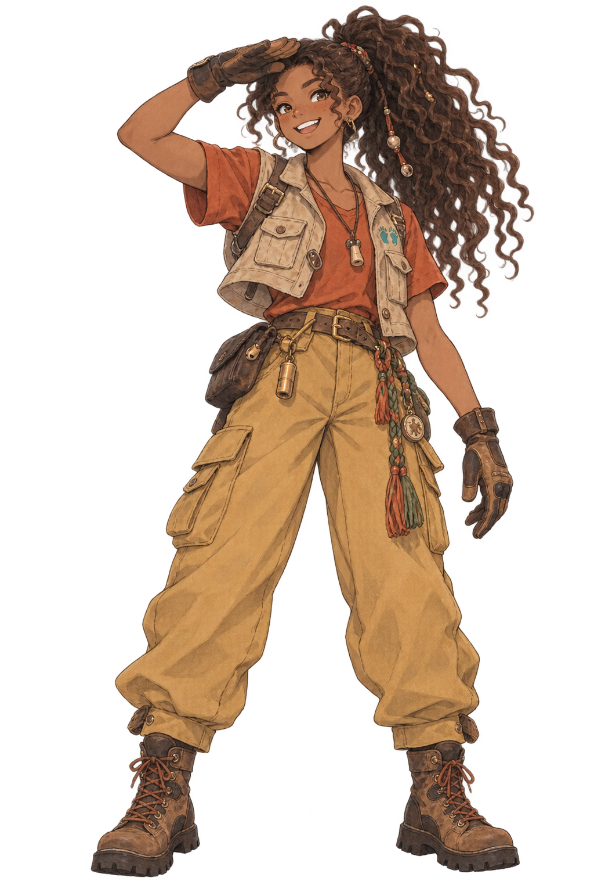

# 캐릭터

## 구성과 사용 원칙

아르카디아에는 서로 다른 성향과 배경을 가진 학생 캐릭터 32명이 설정되어 있습니다. 남학생 16명, 여학생 16명으로 구성합니다. 각 인물의 MBTI 표기는 제작용 성격 참조이지, 플레이어를 분류·평가하거나 대사의 정답을 정하는 장치가 아닙니다.

보이는 성장 스탯의 기본 시작값은 `지식 / 표현력 / 솜씨 / 탐험 / 마법 = 각 50`입니다. 체력은 모든 캐릭터가 동일하게 `100`으로 시작하며 캐릭터별 보정 대상에서 제외합니다.

- 게임 시작 시 남학생 3명, 여학생 3명, 총 **6명**을 기본 오픈합니다.
- 기본 오픈 캐릭터는 다양한 취향으로 고를 수 있도록 성격과 플레이 이미지가 겹치지 않게 구성하고 **스탯 보정을 적용하지 않습니다.**
- 나머지 26명은 캐릭터의 설정과 강점·약점에 따라 성장 스탯 하나에 `+10`, 다른 하나에 `-10`을 적용합니다.
- 따라서 보정 캐릭터도 성장 스탯 총합은 기본 캐릭터와 같으며, 해금 캐릭터가 단순 상위호환이 되지 않습니다.
- `+10` 스탯은 기본값 50에서 60, `-10` 스탯은 40으로 시작합니다.

### 기본 오픈 캐릭터 6명

| 성별 | 캐릭터 | 선택 이유 |
|---|---|---|
| 남 | **카엘(CH01)** | 차분하고 멋있는 전략가형 |
| 남 | **로빈(CH15)** | 친근하고 활발한 모험가형 |
| 남 | **니코(CH31)** | 유쾌하고 화려한 쇼맨형 |
| 여 | **세라(CH02)** | 고요하고 신비로운 통찰가형 |
| 여 | **아이리스(CH08)** | 호기심 많고 당찬 실험·모험가형 |
| 여 | **티아(CH16)** | 밝고 사랑스러운 요정 소환사형 |

기본 오픈 6명은 캐릭터 선택 단계에서 특정 스탯 조합을 정답처럼 느끼지 않고 **외형과 성격 취향으로 첫 캐릭터를 선택하게 하는 역할**을 합니다.

## 학생 캐릭터 32명

### 분석가형 — NT

| ID | 인물 | 성별 | 성향 | 핵심 설정 | 초기 상태 | 보정 스탯 | 이미지 |
|---|---|---|---|---|---|---|---|
| CH01 | 카엘 | 남 | INTJ | 그림자 도서관의 전략가. 치밀하지만 감정 표현에 서툼 | **기본 오픈** | 없음 |  |
| CH02 | 세라 | 여 | INTJ | 별을 읽는 은둔 사제. 깊은 통찰과 느린 신뢰 | **기본 오픈** | 없음 |  |
| CH03 | 시온 | 남 | INTP | 룬 마법 이론 연구생. 호기심과 창의적 가설 | 해금 | 마법 +10 / 표현력 -10 |  |
| CH04 | 로엔 | 여 | INTP | 잊힌 고문서 해독가. 근거를 중시하는 분석가 | 해금 | 지식 +10 / 표현력 -10 |  |
| CH05 | 레온 | 남 | ENTJ | 아카데미 총학생회장. 결단력과 높은 기준 | 해금 | 표현력 +10 / 마법 -10 |  |
| CH06 | 벨라 | 여 | ENTJ | 룬 기사단 총지휘관. 대담하지만 감정 조율은 서툼 | 해금 | 솜씨 +10 / 표현력 -10 |  |
| CH07 | 유안 | 남 | ENTP | 마도 연금술사. 재치와 임기응변 | 해금 | 마법 +10 / 지식 -10 |  |
| CH08 | 아이리스 | 여 | ENTP | 시공간 실험가. 실패를 새 시도로 바꾸는 모험가 | **기본 오픈** | 없음 |  |

### 외교관형 — NF

| ID | 인물 | 성별 | 성향 | 핵심 설정 | 초기 상태 | 보정 스탯 | 이미지 |
|---|---|---|---|---|---|---|---|
| CH09 | 에녹 | 남 | INFJ | 은빛 호수의 은둔 예언자. 타인의 상처에 민감 | 해금 | 마법 +10 / 솜씨 -10 |  |
| CH10 | 엘리아 | 여 | INFJ | 정령의 목소리를 듣는 무녀. 따뜻한 중재자 | 해금 | 표현력 +10 / 솜씨 -10 |  |
| CH11 | 루카 | 남 | INFP | 달빛을 노래하는 음유시인. 섬세하고 낭만적 | 해금 | 표현력 +10 / 솜씨 -10 |  |
| CH12 | 리네 | 여 | INFP | 유리 온실의 식물 교감사. 수줍지만 생명을 지킴 | 해금 | 지식 +10 / 표현력 -10 |  |
| CH13 | 아드리안 | 남 | ENFJ | 모두를 이끄는 마음의 등불. 다정한 멘토 | 해금 | 표현력 +10 / 솜씨 -10 |  |
| CH14 | 스텔라 | 여 | ENFJ | 음악당의 조율사. 관계의 화음을 찾음 | 해금 | 표현력 +10 / 탐험 -10 |  |
| CH15 | 로빈 | 남 | ENFP | 바람을 쫓는 자유 유랑자. 빠른 친화력 | **기본 오픈** | 없음 |  |
| CH16 | 티아 | 여 | ENFP | 빛의 요정 소환사. 분위기를 밝히는 인물 | **기본 오픈** | 없음 |  |

### 관리자형 — SJ

| ID | 인물 | 성별 | 성향 | 핵심 설정 | 초기 상태 | 보정 스탯 | 이미지 |
|---|---|---|---|---|---|---|---|
| CH17 | 바론 | 남 | ISTJ | 성벽의 룬 수호 기사. 원칙과 책임 | 해금 | 솜씨 +10 / 표현력 -10 |  |
| CH18 | 클레어 | 여 | ISTJ | 대서고의 수석 기록관. 기록의 정확성 | 해금 | 지식 +10 / 탐험 -10 |  |
| CH19 | 요한 | 남 | ISFJ | 약초원과 온실의 보호자. 세심한 돌봄 | 해금 | 솜씨 +10 / 마법 -10 |  |
| CH20 | 하젤 | 여 | ISFJ | 마음 치유실의 견습생. 인내와 포용 | 해금 | 지식 +10 / 탐험 -10 |  |
| CH21 | 빅터 | 남 | ESTJ | 학원 풍기위원장. 공정과 질서 | 해금 | 지식 +10 / 탐험 -10 |  |
| CH22 | 로렌 | 여 | ESTJ | 룬 마법 훈련 교관. 실력과 명확한 피드백 | 해금 | 솜씨 +10 / 표현력 -10 |  |
| CH23 | 테오 | 남 | ESFJ | 기숙사 생활 반장. 소속감을 만드는 친구 | 해금 | 표현력 +10 / 지식 -10 |  |
| CH24 | 미리엄 | 여 | ESFJ | 학원 축제 준비위원장. 꼼꼼한 조직력 | 해금 | 표현력 +10 / 마법 -10 |  |

### 탐험가형 — SP

| ID | 인물 | 성별 | 성향 | 핵심 설정 | 초기 상태 | 보정 스탯 | 이미지 |
|---|---|---|---|---|---|---|---|
| CH25 | 렌 | 남 | ISTP | 무구 공방의 마석 조각사. 수리와 실천 | 해금 | 솜씨 +10 / 표현력 -10 |  |
| CH26 | 다나 | 여 | ISTP | 룬 메커니즘 엔지니어. 기계적 직관 | 해금 | 마법 +10 / 표현력 -10 |  |
| CH27 | 미엘 | 남 | ISFP | 아틀리에의 수채화가. 조용한 공감 | 해금 | 표현력 +10 / 지식 -10 |  |
| CH28 | 실비아 | 여 | ISFP | 숲의 궁수와 바람의 추적자. 관찰과 집중 | 해금 | 탐험 +10 / 지식 -10 |  |
| CH29 | 카일 | 남 | ESTP | 결투장의 펜싱 챔피언. 대담한 행동 | 해금 | 솜씨 +10 / 지식 -10 |  |
| CH30 | 제나 | 여 | ESTP | 야생 조련사. 솔직하고 추진력 있음 | 해금 | 탐험 +10 / 지식 -10 |  |
| CH31 | 니코 | 남 | ESFP | 무대 위의 환상 마술사. 유쾌한 쇼맨 | **기본 오픈** | 없음 |  |
| CH32 | 리코 | 여 | ESFP | 빛의 리본 무희. 밝은 애정과 축제성 | 해금 | 표현력 +10 / 지식 -10 |  |

## 보정 스탯 사용 기준

캐릭터 보정은 **초기 플레이 감각과 캐릭터성을 구분하기 위한 시작값 차이**입니다.

| 구분 | 처리 |
|---|---|
| 기본 오픈 6명 | 모든 성장 스탯 50, 보정 없음 |
| 해금 캐릭터 26명 | 한 스탯 +10, 한 스탯 -10, 나머지 3개는 50 |
| 체력 | 전 캐릭터 100으로 동일 시작 |
| 장기 성장 | 성장 스탯 공통 범위 0~500 |

수업의 종류와 수업별 성장량이 확정된 뒤 실제 플레이 테스트에서 `±10`의 체감이 지나치게 크거나 작으면 **보정 폭만 재조정**하고, 각 캐릭터의 강점·약점 방향은 유지합니다.

## 주요 안내·조력 인물

- **발렌티누스**는 룬과 세계를 알려주고 모험의 방향을 질문으로 제시하는 스승입니다. 플레이어가 발견해야 할 원인이나 해법을 먼저 밝히지 않습니다.
- **베른**은 마이룸에서 휴식과 돌아보기를 돕는 조력자입니다. 선택을 도덕적으로 채점하지 않습니다. [보관된 이미지](../asset/character/NPC03_bern_032.png)는 기존 자료이며 최종 외형 확정의 근거가 아닙니다.
- **시온(CH03)**은 학생 캐릭터이면서 이야기에서 대화·관계의 상대가 될 수 있습니다. 학생 32명과 별도 인물로 중복 계산하지 않습니다.

초기 캐릭터 문서에는 별도 선배 인물이 주요 인물로 적혀 있으나, 현재 통합 기획의 주요 역할 구성과 일치하지 않습니다. 새 이야기에서 사용할지 여부는 **검토 필요**로 둡니다. 등장 여부를 임의로 확정하지 마세요.

작성 당시 캐릭터 마스터·통합 기획·이미지 제작 기록을 참고했습니다. 해당 원문은 현재 저장소에 없어 상세 설정이나 선정 이력을 재확인하려면 별도 자료가 필요합니다.
