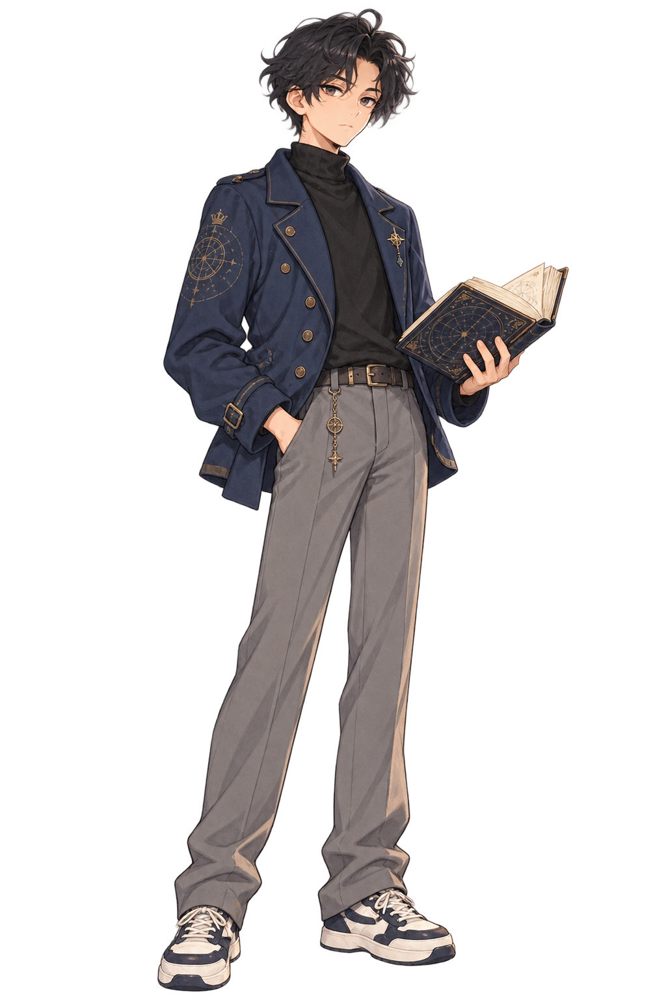
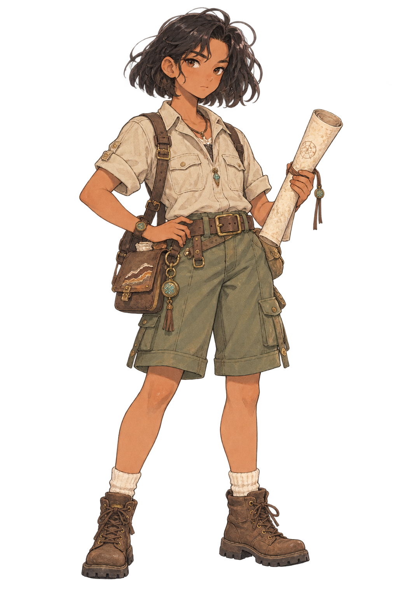
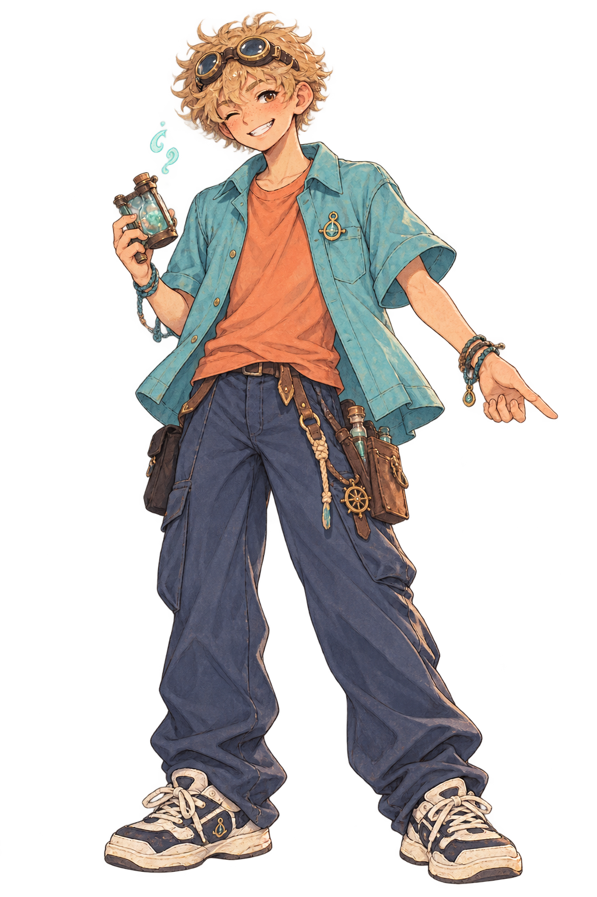
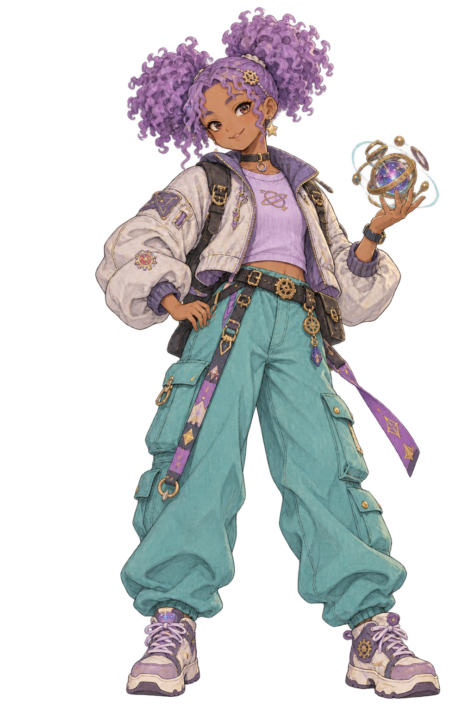
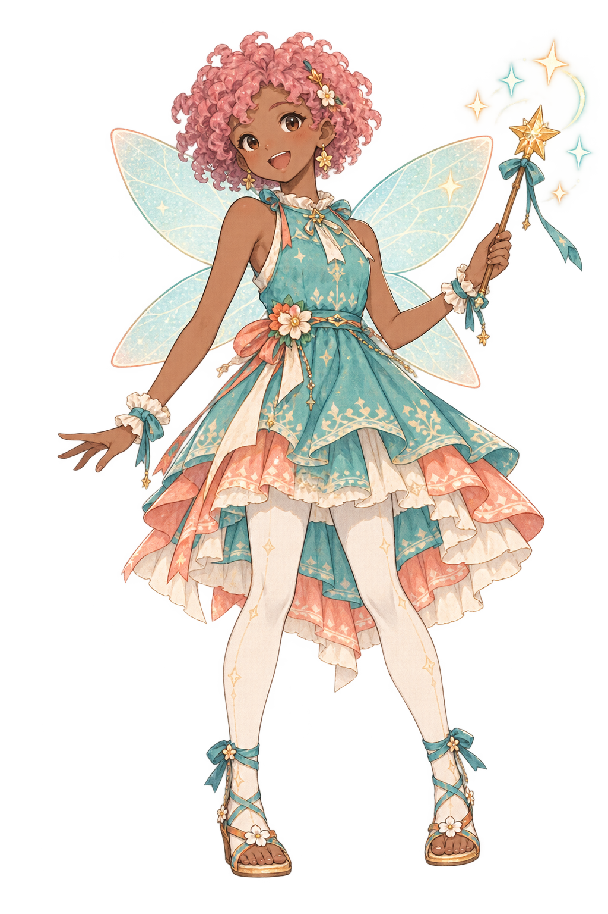
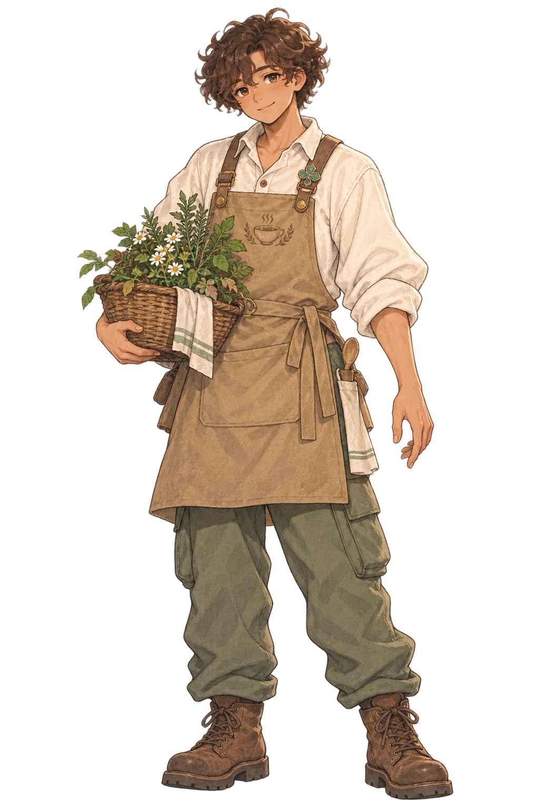
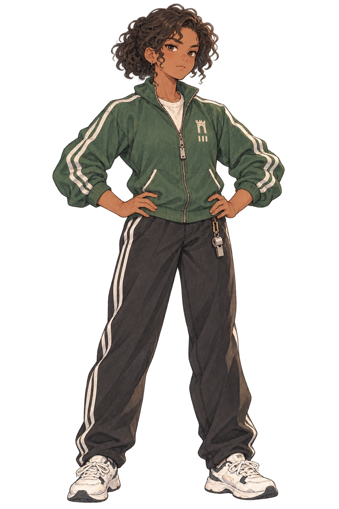
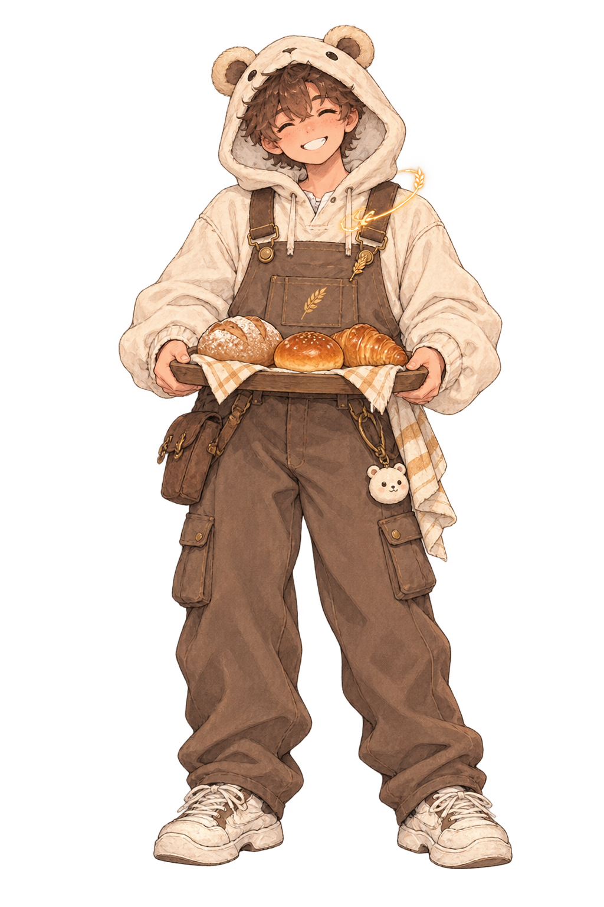
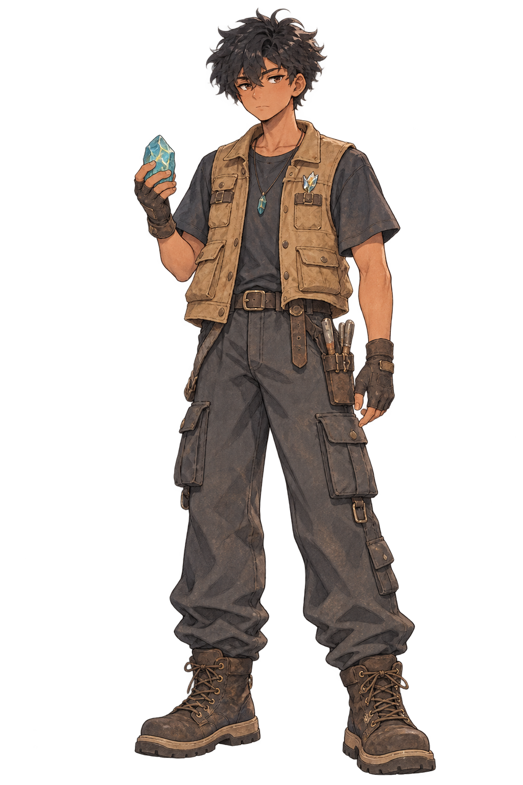
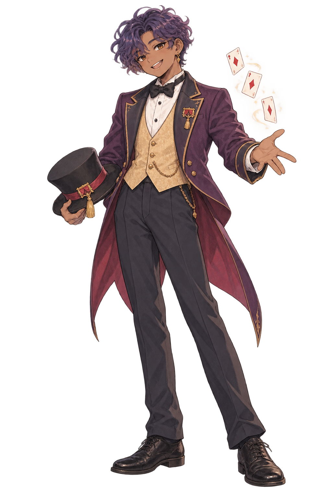

# 👥 [03] 캐릭터 결정 내용 (Characters & NPCs)

> **핵심 결정 사항**: 
> * 조합형(종이인형) 방식의 이질감과 리소스 폭발을 극복하고, **캐릭터 고유의 완성형 일러스트 32종(16 MBTI × 남/여)**으로 전환.
> * 초등학생들이 가장 동경하는 **10대 중후반 (15 ~ 18세 청소년)** 연령대 적용.
> * 웹상에서 살아 숨 쉬는 듯한 **2.5D 마이크로 아이들(Idle) 움직임** 탑재.
> **문서 버전**: v1.0  
> **작성 일자**: 2026-09-23  

---

## 1. 캐릭터 기획 및 연출 방향

### 1.1 완성형 캐릭터(32종) 채택 배경
* **조합형(모듈러) 방식의 한계**:
  * 의상, 헤어, 피부색을 낱개 레이어로 합성할 경우 목선 결합이 어색해 스티커처럼 붕 떠 보이는 이질감 발생.
  * 카르테시안 곱으로 인한 에셋 제작 분량 폭증 문제.
* **완성형 채택의 효과**:
  * 32명의 캐릭터마다 『룬의 아이들』 풍의 고유하고 기품 있는 판타지 복식과 실루엣을 100% 온전하게 표현.
  * 캐릭터 하나하나가 독창적인 성격과 가문 배경, 고유한 대사를 지닌 아이코닉한 인물로 완성됨.

### 1.2 2.5D 마이크로 아이들(Idle) 애니메이션
멈춰 있는 정적 일러스트가 아닌, 가벼운 웹 셰이더/CSS 애니메이션을 통해 생동감을 부여합니다.
1. **자연스러운 호흡 (Breathing)**: 3.5초 주기의 미세한 상체 스케일링(`scale(1.00, 1.015)`) 및 상하 부유.
2. **눈 깜빡임 (Eye Blinking)**: 4~6초 주기로 부드럽게 깜빡이는 눈동자 연출.
3. **바람의 흔들림 (Wind Sway)**: 머리카락 끝과 망토 자락이 잔잔한 룬의 바람에 살랑이는 효과.
4. **마법 룬 파티클 (Floating Rune motes)**: 캐릭터 주위로 은은하게 피어오르는 금빛/푸른빛 마법 입자.

---

## 2. 32종 MBTI 완성형 캐릭터 마스터 데이터

---

### 🏛️ [1] 분석가형 (NT 그룹) — 이성과 탐구

#### 1. INTJ (용의주도한 전략가)
* **남: 카엘 (Kael, 17세)**

  

  * **칭호**: 그림자 도서관의 전략가
  * **가문/배경**: 왕실의 천문과 역사를 기록해 온 명문 서지학 가문의 차남. 엄격한 조부의 훈육으로 감정을 억누르는 법을 배움.
  * **성격**: 냉철한 통찰력과 치밀한 계획성. 겉으로는 무뚝뚝하지만, 위기 시 동료를 위해 가장 안전한 퇴로를 미리 열어둠.
  * **장점**: 어떤 혼란 속에서도 이성을 잃지 않고 최적의 해법 도출.
  * **단점**: 감정적 호소에 둔감하여 직설적인 독설을 내뱉음.
  * **말투**: 나직하고 건조한 어조. *"계획이 없는 마법은 우연에 기대는 도박일 뿐이야. 변수부터 계산하고 움직여."*
* **여: 세라 (Serah, 17세)**

  

  * **칭호**: 별을 읽는 은둔 사제
  * **가문/배경**: 북부 설원 신전에서 고대 신탁을 지키던 가문의 정통 후계자.
  * **성격**: 독립적이고 고요하며, 밤하늘을 관측하며 깊은 사색에 잠김.
  * **장점**: 편견 없이 사건의 본질과 이면을 꿰뚫어 보는 통찰.
  * **단점**: 마음을 여는 데 시간이 매우 오래 걸리며 고립을 자초함.
  * **말투**: 품격 있고 차분한 높임말. *"별의 궤적은 거짓을 고하지 않습니다. 감정의 파도를 가라앉히면 진실이 보일 거예요."*

#### 2. INTP (논리적인 사색가)
* **남: 시온 (Sion, 16세)**

  

  * **칭호**: 룬 마법 이론 연구생
  * **가문/배경**: 평생 고대 마도학 연구에 미친 괴짜 학자 부모 밑에서 책을 친구 삼아 자람.
  * **성격**: 호기심의 화신. 주변의 소음엔 무관심하지만 풀리지 않는 난제엔 밤을 새움.
  * **장점**: 통념을 완전히 뒤엎는 혁신적이고 창의적인 원리 증명.
  * **단점**: 현실 감각이 부족하고 타인의 기분을 헤아리는 감수성이 턱없이 부족.
  * **말투**: 중얼거리듯 빠른 어조. *"어라...? 이 룬 식의 배열, 기존 학설과 모순되잖아? 잠깐만, 내 가설이 맞다는 걸 증명해야 해."*
* **여: 로엔 (Roen, 16세)**

  

  * **칭호**: 잊혀진 고문서 해독가
  * **가문/배경**: 대륙 전역의 미개척 유적을 발굴하는 탐사대 가문 출신.
  * **성격**: 조용하지만 지적 승부욕이 강하며 불합리한 권위에 굴복하지 않음.
  * **장점**: 방대한 텍스트 속에서 숨겨진 암호와 연결고리를 찾는 집요한 분석력.
  * **단점**: 자신이 옳다고 확신하면 타협하지 않아 융통성 없다는 평을 받음.
  * **말투**: 조근조근한 반박조. *"그 주장은 3조 2항의 역사적 사실과 모순돼. 타당한 근거가 없는데 어떻게 믿어?"*

#### 3. ENTJ (대담한 통솔자)
* **남: 레온 (Leon, 18세)**

  

  * **칭호**: 아카데미 총학생회장
  * **가문/배경**: 대륙 남부의 명망 높은 정치·외교 명가의 장남. 지도자 교육을 철저히 받음.
  * **성격**: 압도적인 카리스마와 결단력. 전체의 목표를 위해 깃발을 들고 전진하는 지휘관.
  * **장점**: 사람들의 잠재력을 간파하고 적재적소에 배치하여 승리를 이끎.
  * **단점**: 기준이 너무 높아 주변 사람들에게 과도한 중압감을 줌.
  * **말투**: 단호하고 신뢰감을 주는 어조. *"망설일 시간은 끝났다. 결과의 책임은 내가 질 테니, 날 믿고 돌파구를 열어라."*
* **여: 벨라 (Bella, 18세)**

  

  * **칭호**: 룬 기사단 총지휘관
  * **가문/배경**: 대대로 왕국 수비의 중추를 맡아온 무인 기사 가문의 장녀.
  * **성격**: 당당하고 진취적이며 명예와 신념을 목숨보다 소중히 여김.
  * **장점**: 극한의 위기에서도 흔들리지 않는 대담함과 강력한 추진력.
  * **단점**: 성격이 급하고 승부욕이 지나쳐 섬세한 감정 조율에 서툼.
  * **말투**: 절도 있고 씩씩한 어조. *"주저앉아 한숨 쉴 시간에 검을 한 번 더 쥐어! 쓰러지면 내가 부축할 테니, 등을 보이지 마!"*

#### 4. ENTP (뜨거운 논쟁을 즐기는 혁신가)
* **남: 유안 (Yuan, 16세)**

  

  * **칭호**: 기상천외한 마도 연금술사
  * **가문/배경**: 전 대륙의 항로를 개척한 거상 무역 선단 출신으로 이국적인 문물에 밝음.
  * **성격**: 번뜩이는 재치와 유쾌한 반골 기질. 세상의 모든 금기와 편견을 뒤흔듦.
  * **장점**: 위기를 한순간에 유쾌한 기회로 뒤바꾸는 최고의 임기응변.
  * **단점**: 뒷수습을 생각하지 않고 일을 벌이거나 장난이 지나침.
  * **말투**: 능청스러운 어조. *"교수님들이 그건 금기라고 하셨어? 그렇다면 뒤집어서 폭발시키면 어떻게 될지 궁금하지 않아?"*
* **여: 아이리스 (Iris, 16세)**

  

  * **칭호**: 시공간 왜곡 실험가
  * **가문/배경**: 학계에서 파문당한 천재 발명가의 딸로 매혹적인 마도 공학을 계승.
  * **성격**: 거침없는 호기심, 지칠 줄 모르는 에너지, 내기를 좋아하는 당찬 모험가.
  * **장점**: 실패를 겪어도 웃어넘기며 새로운 해결책을 창조해 냄.
  * **단점**: 진지해야 할 순간에도 농담을 던져 오해를 사기도 함.
  * **말투**: 빠르고 자신감 넘치는 어조. *"틀리면 어때? 다시 뒤집어엎으면 되지! 내 이론이 맞다는 걸 똑똑히 보여줄게."*

---

### 🌿 [2] 외교관형 (NF 그룹) — 이상과 공감

#### 5. INFJ (선의의 옹호자)
* **남: 에녹 (Enoch, 17세)**

  

  * **칭호**: 은빛 호수의 은둔 예언자
  * **가문/배경**: 멸망한 고대 왕국의 마지막 핏줄로 가문의 비극적인 비밀을 짊어짐.
  * **성격**: 깊은 공감과 통찰력, 조용하지만 결코 꺾이지 않는 내면의 신념.
  * **장점**: 말하지 않아도 친구의 내면에 숨겨진 외로움과 상처를 보듬어 줌.
  * **단점**: 모든 사람의 고통을 홀로 짊어지려다 스스로 지쳐 고립됨.
  * **말투**: 온화하고 나직한 어조. *"괜찮은 척 미소 짓지 않아도 돼. 네 침묵 뒤에 숨겨진 무거운 짐을... 난 느끼고 있어."*
* **여: 엘리아 (Elia, 17세)**

  

  * **칭호**: 정령의 목소리를 듣는 무녀
  * **가문/배경**: 깊은 성소에서 숲과 호수의 정령을 모시던 은둔 민족의 장녀.
  * **성격**: 맑고 고요한 영혼. 타인에 대한 이타심과 조화를 최우선으로 여김.
  * **장점**: 얽힌 인간관계의 오해를 눈 녹듯 풀어내는 따뜻한 중재력.
  * **단점**: 갈등 자체를 극도로 두려워해 자신의 솔직한 욕구를 억누름.
  * **말투**: 서정적인 높임말. *"숲의 바람이 떨고 있어요. 우리 서로에게 조금만 더 너그러워질 수는 없을까요?"*

#### 6. INFP (열정적인 중재자)
* **남: 루카 (Luka, 16세)**

  

  * **칭호**: 달빛을 노래하는 음유시인
  * **가문/배경**: 대륙을 방랑하는 유랑 극단에서 태어나 하프 선율과 별빛 아래서 성장.
  * **성격**: 풍부한 감수성과 낭만, 세상의 모든 작고 여린 것들에 대한 깊은 애정.
  * **장점**: 타인의 개성을 편견 없이 순수하게 존중해 줌.
  * **단점**: 거친 비판이나 차가운 시선에 쉽게 마음에 상처를 입고 숨어버림.
  * **말투**: 조심스럽고 시적인 어조. *"길가에 핀 작은 풀잎이라도 저마다의 노래를 품고 있어. 네 마음의 선율도 참 아름다워."*
* **여: 리네 (Rinne, 15세)**

  

  * **칭호**: 유리 온실의 식물 교감사
  * **가문/배경**: 아르카디아 정원을 수호해 온 식물학자 집안의 막내딸.
  * **성격**: 낯가림이 심하고 수줍음이 많지만, 생명을 지키는 일에는 한없이 단호함.
  * **장점**: 곁에 있는 것만으로도 사람의 마음을 차분하게 가라앉히는 온화한 치유력.
  * **단점**: 거절을 너무 힘들어해 스스로 스트레스를 껴안음.
  * **말투**: 수줍고 나긋나긋한 어조. *"혹시... 마음이 많이 시리면 이 허브 차를 마셔볼래? 작은 온기라도 건네고 싶어."*

#### 7. ENFJ (정의로운 주인공)
* **남: 아드리안 (Adrian, 17세)**

  

  * **칭호**: 모두를 이끄는 마음의 등불
  * **가문/배경**: 가난하고 소외된 자들을 구호해 온 자선 길드 가문의 후계자.
  * **성격**: 다정다감하고 이타적이며, 친구들이 각자의 꿈을 찾도록 돕는 타고난 멘토.
  * **장점**: 소외된 이 하나 없이 모두를 하나의 따뜻한 공동체로 묶어냄.
  * **단점**: 타인의 문제를 해결하는 데 몰두하다 정작 자신을 돌보지 못함.
  * **말투**: 따스하고 격려가 담긴 어조. *"넌 네가 생각하는 것보다 훨씬 빛나는 존재야. 내가 네 곁에서 손을 잡아줄게."*
* **여: 스텔라 (Stella, 17세)**

  

  * **칭호**: 음악당의 조율사
  * **가문/배경**: 궁정 관현악단을 이끌던 예술가 가문 출신.
  * **성격**: 활달하고 배려심 넘치며, 불협화음이 나는 관계를 아름답게 조율함.
  * **장점**: 상대방의 사소한 장점도 놓치지 않고 칭찬하여 용기를 불어넣음.
  * **단점**: 모두에게 좋은 사람으로 남으려다 단호한 쓴소리를 하지 못함.
  * **말투**: 활기차고 다정한 어조. *"우리 함께 화음을 맞춰보자! 서로 다른 음색이 어우러져야 비로소 아름다운 노래가 되잖아."*

#### 8. ENFP (재기발랄한 활동가)
* **남: 로빈 (Robin, 16세)**

  

  * **칭호**: 바람을 쫓는 자유 유랑자
  * **가문/배경**: 미지의 땅을 탐험하는 전설적인 모험가 부부의 아들.
  * **성격**: 호기심과 순수한 열정의 화신. 새로운 친구와 모험을 찾아 끊임없이 달림.
  * **장점**: 처음 만난 사람과도 5분 만에 둘도 없는 친구가 되는 친화력.
  * **단점**: 흥미가 쉽게 식어 마무리를 짓지 못하고 충동적인 면모를 보임.
  * **말투**: 감탄사가 많고 유쾌한 어조. *"저 성벽 너머에 뭐가 숨어 있는지 궁금하지 않아? 당장 가보자, 신나는 일이 기다릴 거야!"*
* **여: 티아 (Tia, 15세)**

  

  * **칭호**: 빛의 요정 소환사
  * **가문/배경**: 대륙의 축제와 마법 불꽃놀이를 주관하는 유쾌한 마술사 집안 출신.
  * **성격**: 천진난만하고 사랑스러우며, 사람들에게 웃음을 주는 일에 진심인 분위기 메이커.
  * **장점**: 어두운 침묵과 절망을 순식간에 희망찬 축제로 뒤바꾸는 긍정의 힘.
  * **단점**: 감정 기복이 크고 집중력이 쉽게 흩어짐.
  * **말투**: 통통 튀고 발랄한 어조. *"우울할 땐 날 봐! 내 요정들이 네 머리 위에 반짝이는 웃음 가루를 듬뿍 뿌려줄 테니까!"*

---

### 🛡️ [3] 관리자형 (SJ 그룹) — 원칙과 헌신

#### 9. ISTJ (청렴결백한 논리주의자)
* **남: 바론 (Baron, 18세)**

  

  * **칭호**: 성벽의 룬 수호 기사
  * **가문/배경**: 3대째 아르카디아 성벽과 정문을 묵묵히 지켜온 근위병 가문.
  * **성격**: 철저한 원칙주의와 강직한 책임감. 약속은 목숨처럼 지킴.
  * **장점**: 가혹한 폭풍우 속에서도 맡은 자리와 의무를 결코 저버리지 않는 묵직함.
  * **단점**: 융통성을 발휘하지 못해 답답하고 냉정하다는 오해를 받음.
  * **말투**: 절제된 군인 어조. *"학원 규정 제5조, 야간 자율 통행은 불허한다. 원칙이 무너지면 모든 안전도 무너진다."*
* **여: 클레어 (Claire, 17세)**

  

  * **칭호**: 대서고의 수석 기록관
  * **가문/배경**: 국가의 연대기와 칙령을 기록해 온 사서 가문의 장녀.
  * **성격**: 정숙하고 단정하며, 단 한 글자의 오자나 훼손도 용납하지 않는 꼼꼼함.
  * **장점**: 방대한 사안 속에서 오류를 잡아내고 질서를 세우는 정밀함.
  * **단점**: 사소한 규율 위반에도 지나치게 엄격하여 주변을 피로하게 함.
  * **말투**: 또박또박한 어조. *"기록에 사적인 감정을 섞지 마세요. 진실은 오직 사실 그대로 보존되어야 합니다."*

#### 10. ISFJ (용감한 수호자)
* **남: 요한 (Johann, 17세)**

  

  * **칭호**: 약초원과 온실의 보호자
  * **가문/배경**: 마을 어귀에서 작은 식당과 구호소를 운영하는 온정 넘치는 집안.
  * **성격**: 온화하고 세심하며, 남들이 꺼리는 궂은일을 군말 없이 도맡음.
  * **장점**: 친구들의 사소한 표정 변화와 불편을 기가 막히게 알아채고 보살핌.
  * **단점**: 거절을 못 하고 속으로만 삭이다가 번아웃에 빠짐.
  * **말투**: 부드럽고 다정한 어조. *"옷깃이 뜯어졌네. 금방 꿰매줄 테니 잠시만 기다려. 다치진 않아서 다행이야."*
* **여: 하젤 (Hazel, 16세)**

  

  * **칭호**: 마음 치유실의 견습생
  * **가문/배경**: 전통 있는 약제사 및 간호 의술 가문 출신.
  * **성격**: 자애롭고 인내심이 깊으며, 상처 입은 이들의 눈물을 묵묵히 닦아줌.
  * **장점**: 어떤 불안 속에서도 상대방에게 평온과 안정을 되찾아 주는 깊은 포용력.
  * **단점**: 익숙한 환경을 벗어나는 급격한 변화에 심한 두려움을 느낌.
  * **말투**: 상냥한 높임말. *"따뜻한 모과차를 달여왔어요. 천천히 드시면서... 힘겨웠던 마음을 털어내 보세요."*

#### 11. ESTJ (엄격한 관리자)
* **남: 빅터 (Victor, 18세)**

  

  * **칭호**: 학원 풍기위원장
  * **가문/배경**: 대륙 최고 법원의 판관을 지망하는 엄격한 법률가 집안.
  * **성격**: 공명정대, 체계적인 실행력, 질서와 원칙을 세우는 데 타협이 없음.
  * **장점**: 혼란과 분열에 빠진 집단을 강력한 통솔로 단숨에 정상화함.
  * **단점**: 규율 이면의 사정을 헤아리지 못해 독단적이라는 평가를 받음.
  * **말투**: 단호한 명령조. *"공과 사는 엄격히 구분되어야 한다. 개인의 감정을 앞세워 공동체의 법도를 흔들지 마라."*
* **여: 로렌 (Lauren, 18세)**

  

  * **칭호**: 룬 마법 훈련 교관
  * **가문/배경**: 국경 요새의 최정예 수비대장 가문 출신의 여장부.
  * **성격**: 현실적이고 직설적이며 결과와 실력으로 가치를 증명하는 실력주의자.
  * **장점**: 두려움을 모르는 결단력과 명확한 피드백으로 동료를 성장시킴.
  * **단점**: 직설적인 비판으로 의도치 않게 타인의 자존감에 상처를 줌.
  * **말투**: 씩씩하고 직설적인 어조. *"변명은 연병장 바깥에 두고 와. 네가 흘린 땀방울만이 네 실력을 증명한다."*

#### 12. ESFJ (사교적인 외교관)
* **남: 테오 (Theo, 17세)**

  

  * **칭호**: 기숙사 생활 반장
  * **가문/배경**: 대도시에서 가장 유명한 베이커리와 여관을 운영하는 친화력 넘치는 집안.
  * **성격**: 붙임성 좋고 다정하며, 모두가 어울려 웃을 수 있는 분위기를 만듦.
  * **장점**: 구성원들의 갈등을 매끄럽게 중재하고 끈끈한 소속감을 심어줌.
  * **단점**: 타인의 비판이나 소외에 민감하며 주변 평판에 휘둘림.
  * **말투**: 상냥하고 배려 넘치는 어조. *"오늘 간식으로 갓 구운 무화과 파이가 들어왔어! 다들 라운지에 모여서 같이 먹자, 응?"*
* **여: 미리엄 (Miriam, 17세)**

  

  * **칭호**: 학원 축제 준비위원장
  * **가문/배경**: 사교계와 축제 기획을 주도하는 명망 높은 상인 연합 가문.
  * **성격**: 밝고 열정적이며 사람들에게 감동을 선사하는 축제를 기획함.
  * **장점**: 꼼꼼한 조직력과 모든 사람을 품는 넉넉한 인심.
  * **단점**: 베푼 호의에 대해 상대방이 고마움을 표하지 않으면 큰 서운함을 느낌.
  * **말투**: 활기찬 어조. *"혼자 고민하지 말고 나한테 털어놔 봐! 우린 한 가족이잖아, 내가 꼭 힘이 되어줄게."*

---

### 🗡️ [4] 탐험가형 (SP 그룹) — 자유와 실전

#### 13. ISTP (만능 재주꾼)
* **남: 렌 (Ren, 16세)**

  

  * **칭호**: 무구 공방의 마석 조각사
  * **가문/배경**: 척박한 광산 지대의 대장장이 가문으로 어릴 적부터 마석을 다룸.
  * **성격**: 과묵하고 무표정하지만 손재주와 기계적 직관은 천재적인 실천파.
  * **장점**: 위기 상황에서 고장 난 도구를 즉석에서 수리하고 해결책을 만듦.
  * **단점**: 감정적 위로나 공감에 서툴며 인간관계를 성가시게 여김.
  * **말투**: 짧고 건조한 어조. *"망가졌으면 고치면 그만이야. 울고 있을 시간에 렌치나 집어줘."*
* **여: 다나 (Dana, 16세)**

  

  * **칭호**: 룬 메커니즘 엔지니어
  * **가문/배경**: 시계 장치와 정밀 마도 오토마톤을 연구하는 장인 가문의 후계자.
  * **성격**: 쿨하고 독립적이며 복잡한 톱니바퀴와 룬 회로 조립에 몰입함.
  * **장점**: 냉철한 상황 판단력과 실용적인 문제 해결력.
  * **단점**: 단체 행동을 꺼리고 혼자 독단적으로 움직여 주변을 긴장시킴.
  * **말투**: 간결한 어조. *"복잡하게 생각하지 마. 핵심 태엽 하나만 바로잡으면 굴러가니까 비켜봐."*

#### 14. ISFP (호기심 많은 예술가)
* **남: 미엘 (Miel, 16세)**

  

  * **칭호**: 아틀리에의 수채화가
  * **가문/배경**: 숲속 작은 아틀리에에서 천연 염료를 만들고 풍경화를 그리는 예술가 집안.
  * **성격**: 온유하고 겸손하며 세상의 아름다운 색채와 사람 마음에 민감함.
  * **장점**: 타인의 아픔을 편견 없이 수용하고 곁을 묵묵히 지켜주는 평화주의자.
  * **단점**: 경쟁과 갈등을 극도로 혐오하여 중요한 결정 순간에 뒤로 물러섬.
  * **말투**: 부드러운 어조. *"오늘 호숫가 노을빛이 참 따뜻해... 네 마음의 불안도 이 노을처럼 녹아내렸으면 좋겠어."*
* **여: 실비아 (Sylvia, 16세)**

  

  * **칭호**: 숲의 궁수와 바람의 추적자
  * **가문/배경**: 숲의 경계를 순찰하는 유서 깊은 수렵 기사단 가문 출신.
  * **성격**: 말수가 적고 신중하며 자연의 흐름에 순응하며 살아가는 사냥꾼.
  * **장점**: 탁월한 오감과 동물과의 교감 능력, 흔들림 없는 집중력.
  * **단점**: 딱딱한 책상머리 규율을 답답해하며 규칙을 무시하고 숲으로 숨음.
  * **말투**: 차분한 어조. *"바람의 결이 바뀌었어. 네가 망설이고 있다는 뜻이야. 심호흡을 하고 네 직관을 믿어봐."*

#### 15. ESTP (모험을 즐기는 사업가)
* **남: 카일 (Kyle, 17세)**

  

  * **칭호**: 결투장의 펜싱 챔피언
  * **가문/배경**: 대륙 횡단 투기장을 운영하는 호걸 가문의 막내아들.
  * **성격**: 호탕하고 대담하며 승부와 스릴 앞에서 심장이 가장 뜨겁게 뜀.
  * **장점**: 돌발적인 위험 속에서 주저 없이 몸을 던져 판도를 뒤엎는 순발력.
  * **단점**: 충동적이고 뒷일을 깊게 생각하지 않아 무모한 사고를 유발함.
  * **말투**: 자신만만한 어조. *"책상머리에서 머리 쥐어짜면 답이 나와? 일단 부딪쳐 봐야지! 내가 앞장설 테니 꽉 잡아!"*
* **여: 제나 (Zena, 17세)**

  

  * **칭호**: 맹수를 다루는 야생 조련사
  * **가문/배경**: 광활한 초원에서 거친 마수를 길들이는 유목민 부족의 전사.
  * **성격**: 거침없고 씩씩하며 솔직담백하여 뒤끝이 전혀 없는 야성의 소녀.
  * **장점**: 엄청난 행동력과 어떤 권위 앞에서도 주눅 들지 않는 배짱.
  * **단점**: 성미가 급해 상대방의 설명을 끝까지 듣지 않고 행동부터 앞섬.
  * **말투**: 호쾌한 어조. *"어물거리다간 사냥감을 놓쳐! 네 심장이 뛰는 방향으로 지금 당장 전력 질주해!"*

#### 16. ESFP (자유로운 영혼의 연예인)
* **남: 니코 (Nico, 16세)**

  

  * **칭호**: 무대 위의 환상 마술사
  * **가문/배경**: 대륙 최고의 유람 가극단 출신으로 무대 조명과 갈채 속에서 성장.
  * **성격**: 유쾌하고 익살스러우며 사람들의 시선을 사로잡고 웃음을 주는 쇼맨.
  * **장점**: 어떤 냉랭하고 어색한 분위기도 단숨에 축제로 뒤바꿈.
  * **단점**: 깊고 무거운 감정적 갈등이나 진지한 책임을 회피하려 함.
  * **말투**: 익살스러운 어조. *"자, 고개 숙인 신사 숙녀 여러분! 오늘의 주인공은 바로 너야! 인상 펴고 멋진 쇼를 즐겨보자고!"*
* **여: 리코 (Riko, 15세)**

  

  * **칭호**: 빛의 리본 무희
  * **가문/배경**: 왕실 무도회 의상을 전담하는 화려한 패션 가문의 딸.
  * **성격**: 사랑스럽고 통통 튀며 축제와 예쁜 것을 온 세상에 전파하고 싶어 함.
  * **장점**: 주변 친구들에게 무조건적인 애정과 긍정적 찬사를 보냄.
  * **단점**: 거친 말이나 어두운 분위기를 마주하면 쉽게 상처받고 토라짐.
  * **말투**: 사랑스러운 어조. *"우와! 오늘 네 눈빛 정말 신비로워! 나랑 같이 광장에 가서 춤추자, 분명 마법 같은 일이 일어날 거야!"*

---

## 3. 핵심 상호작용 NPC 캐릭터 3선

초등학생 플레이어가 아르카디아 세계관에 몰입하고 올바른 마음의 성장을 이룰 수 있도록 이끄는 3대 핵심 NPC입니다.

```
┌─────────────────────────────────────────────────────────────┐
│                    [ 핵심 NPC 3대 역할군 ]                  │
│                                                             │
│  [1. 대화/고민 NPC]      [2. 가이드/멘토 NPC]    [3. 마이룸 집사 NPC]  │
│    '이시스 선배'            '발렌티누스 교수'          '베른 (오토마톤)'   │
│   (19세 졸업반 수석)        (학술원장 대마법사)       (황동 부엉이 집사)    │
│  (또래 갈등과 공감)       (지혜와 방향성 안내)       (무조건적 지지와 치유) │
└─────────────────────────────────────────────────────────────┘
```

### 1) 대화 & 갈등 교류 NPC: **이시스 (Isis, 19세 남학생 / 졸업반 수석)**
* **역할**: 대화를 나누며 가문의 기대와 진로, 자아 사이의 갈등을 함께 풀어가는 선배
* **외형**: 단정한 감청색 학원 코트를 입고 은빛 펜을 쥔 차분하고 수려한 청년.
* **배경 & 고뇌**: 유력 가문의 후계자로서 완벽한 수석의 자리를 지켜왔으나, 자신의 진정한 열정인 '식물 약제학'과 '가문의 정치적 기대' 사이에서 깊은 번민을 겪고 있음.
* **인터랙션 의도**: 플레이어(학생)가 이시스 선배와의 대화에서 선택지를 통해 "남의 기대에 맞추는 삶"과 "진짜 내가 원하는 가치"를 고민하고, 타인의 무거운 고민에 진심으로 귀 기울이는 법을 배움.
* **대표 대사**: *"모두가 내게 오차 없는 완벽만을 요구했어... 하지만 넌 내게 진짜 내가 무엇을 하고 싶으냐고 처음으로 물어봐 주었지."*

### 2) 가이드 & 안내 NPC: **발렌티누스 교수 (Professor Valentinus, 60대)**
* **역할**: 학원의 역사와 룬의 원리를 알려주고 모험의 방향을 잡아주는 현명한 스승
* **외형**: 낡은 모직 외투에 깃털 펜과 회중시계를 차고, 돋보기안경 너머로 장난기 어린 인자한 눈빛을 띤 은퇴한 대마법사.
* **성격**: 엉뚱하게 찻잔을 들고 허공을 응시하지만, 아이들의 내면 상태를 누구보다 예리하게 꿰뚫어 봄.
* **인터랙션 의도**: 단순 퀘스트 전달자가 아닌, 소크라테스식 문답을 통해 학생이 정답을 주입받는 대신 스스로 바른 길을 선택하도록 유도.
* **대표 대사**: *"룬은 말이다, 칼날보다 예리하지만 아침 이슬보다 여리단다. 네가 가슴속에 품은 그 마음이 어떤 빛깔의 룬을 깨울지... 나는 벌써부터 설레는구나."*

### 3) 마이룸 전담 집사 NPC: **베른 (Bern, 룬 오토마톤 집사)**
* **역할**: 마이룸에서 아이의 피로를 풀어주고 무조건적인 지지와 칭찬을 보내는 든든한 조력자
* **외형**: 앤티크한 황동 톱니 장치와 벨벳 조끼를 입은 작은 부엉이 인형 형태의 고대 오토마톤.
* **성격**: 깍듯하고 정중한 영국 신사풍이지만 한없이 따뜻함. 항상 찻잔과 따뜻한 벽난로 불을 관리함.
* **인터랙션 의도**: 하루 모험을 마친 아이에게 "오늘 하루도 참 애썼습니다"라는 온전한 지지를 보내고, 하루의 감정을 기록하는 '마음 일기' 작성을 격려함.
* **대표 대사**: *"주인님, 오늘 바깥에서 참으로 쉽지 않은 선택을 하셨군요. 비록 서툴렀을지라도 당신의 진심은 분명 룬에 깊이 새겨졌을 것입니다. 따뜻한 핫초코 한잔 드시겠습니까?"*


---

## 4. 생성 원화 파일 안내

2026-09-30 등록. 학생 32명 각각의 이름으로 03_characters/02_characters/04_images에 PNG 원화를 보관하고 위 인물 항목에 연결했습니다. 기존 기획 본문은 유지했습니다. 이 이미지는 완성형 전신의 생성 원화이며, 게임용 투명 경계 정리·표정/레이어 분리·Idle 리깅은 후속 공정입니다. 알파 채널은 존재하지만 일부 반투명 영역과 빛 번짐에 대한 검수가 필요합니다. 엘리아는 1024×1535, 나머지는 1024×1536입니다.


## 5. 캐릭터 디자인 제작 자료

이번 작업의 이미지·프롬프트·제작 문서는 모두 [03_characters 폴더](03_characters/)에 보관합니다.

- [전체 62장 파일 매칭표](03_characters/README.md)
- [디자인 제작 명세서](03_characters/01_design/01_design_spec.md)
- [아이템 원화](03_characters/03_items/01_overview.md)
- [배경 원화](03_characters/04_backgrounds/01_overview.md)
