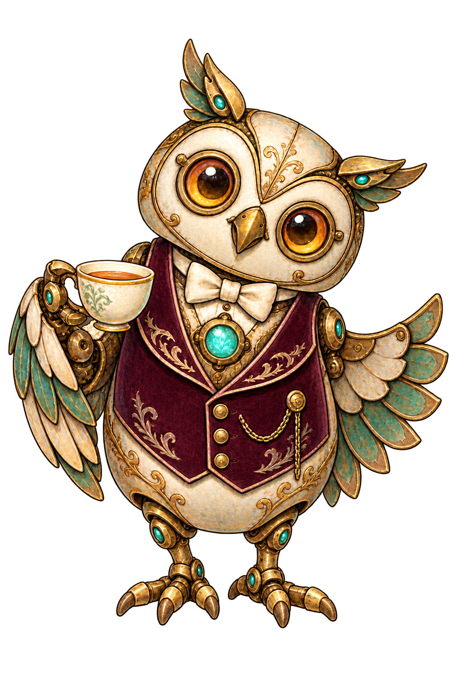

# 02_characters — Prototype 생성 결과

생성 파일이며 게임 적용 QA는 미완료. 04_images는 초기 테스트 규격, 05_sources는 생성 원본. 리사이즈는 종횡비 유지(투명 개체는 contain, 불투명 배경은 cover). 크기 일치는 미술·알파·애니메이션 합격을 의미하지 않는다.

## NPC03 베른

- 원본: 1024×1536 / 테스트 파일: 1024×1536
- 상태: generated_pending_game_qa, 샘플 알파: 0~254

## 베른 후광 수정 시도
v3·v4는 배경 제거에 실패한 검수 시안이며 실제 사용 후보에서 제외. 별도 엘리아 규격 내보내기는 06_exports에 저장.
