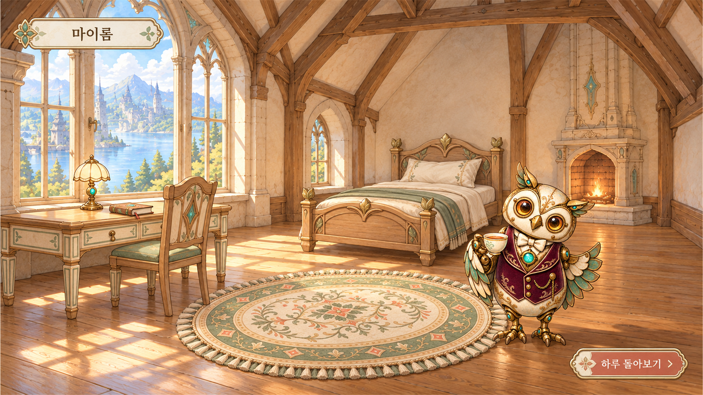

# SC01 마이룸 완성 화면 시안

- 납품 크기: 1920×1080 PNG, 불투명. 생성 원본: 1672×941, 05_sources에 보존. 내보내기는 크기 조정이며 새 고해상도 디테일 생성이 아니다.
- 용도: 2.5D Life 마이룸 전체 아트디렉션 확인용 한 컷. 엔진 실행 캡처나 원본 픽셀 그대로의 합성 검증본은 아니다.
- 직접 이미지 참조: BG03·NPC03·IT07·IT09·IT11. IT08·IT02·IT01은 직접 열어 확인한 뒤 형태를 텍스트로 설명했다(도구 참조 이미지 최대5개).
- 제작: 실제 이미지 생성 1회. 최초8개 참조 요청은 도구 입력 제한으로 실행되지 않았고 5개 참조로 조정했다. 원본·개별 에셋 재생성 또는 덮어쓰기 없음.

## 배치와 관찰

창가 왼쪽에 책상·의자·램프·일기, 뒤쪽에 침대, 중앙 바닥에 러그, 오른쪽 전경에 베른을 배치했다. 창의 왼쪽 주광원과 가구 접지 그림자를 통일했다. 가구 크림·세이지·황동과 배경 목재가 조화되고, 베른의 자주색이 주목점을 만든다.

원본 가구는 내려다보는 각도가 배경보다 커서 시안에서 원근을 조정했다. 램프·책·의자의 세부 형태는 원본과 차이가 있다. 베른 후광이 장면 안에서 보이지 않더라도 원본 투명 이미지의 후광이 해결된 것은 아니다. 이 그림을 근거로 현재 개별 에셋의 게임 적용 QA를 완료 처리하지 않는다.

## 다음 작업의 기준

이 컷의 배치·가구 비율·광원·그림자를 기준으로 실제 배경/가구/소품/베른/UI 레이어를 조립해 비교한다. UI 글자는 게임에서 별도 텍스트로 제공하며, 이 컷에 그려진 버튼은 조작 가능한 UI가 아니다. 다른 장소 시안이나 새 에셋은 이번에 추가하지 않았다.
