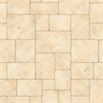
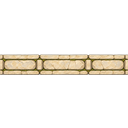
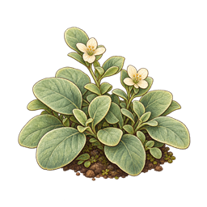
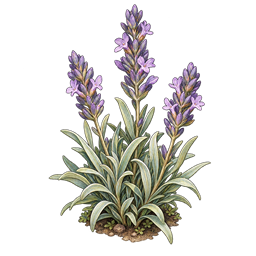
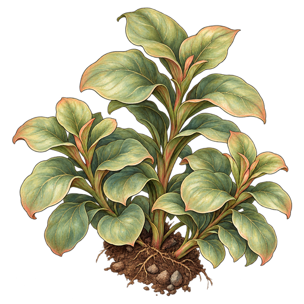
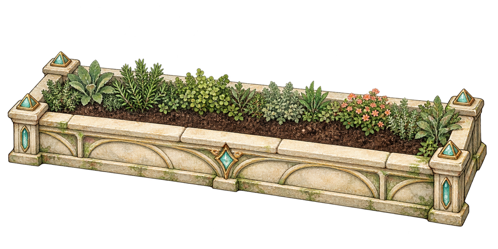
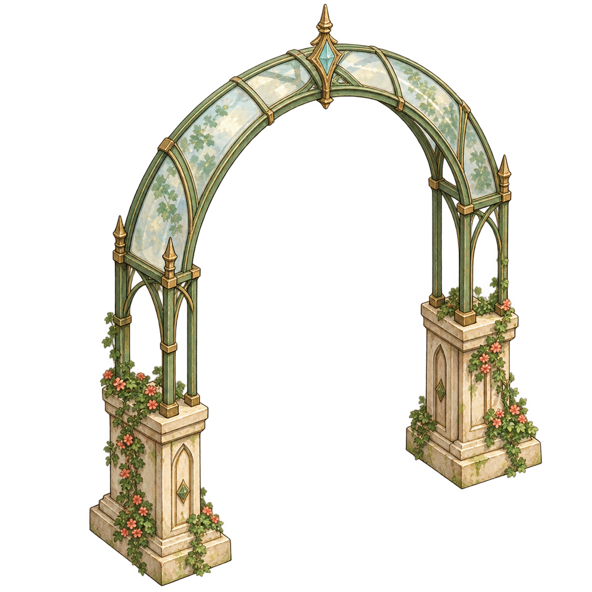

# 07_adventure_environment — Prototype 생성 결과

생성 파일이며 게임 적용 QA는 미완료. 04_images는 초기 테스트 규격, 05_sources는 생성 원본. 리사이즈는 종횡비 유지(투명 개체는 contain, 불투명 배경은 cover). 크기 일치는 미술·알파·애니메이션 합격을 의미하지 않는다.

## ENV01 온실_바닥_기본

- 원본: 1254×1254 / 테스트 파일: 128×128
- 상태: generated_pending_game_qa, 샘플 알파: 255~255

## ENV02 온실_바닥_변형_A

- 원본: 1254×1254 / 테스트 파일: 128×128
- 상태: generated_pending_game_qa, 샘플 알파: 255~255

## ENV03 온실_바닥_변형_B

- 원본: 1254×1254 / 테스트 파일: 128×128
- 상태: generated_pending_game_qa, 샘플 알파: 255~255

## ENV04 온실_경계

- 원본: 1254×1254 / 테스트 파일: 128×128
- 상태: generated_pending_game_qa, 샘플 알파: 0~255

## ENV05 작은_식물_A

- 원본: 1254×1254 / 테스트 파일: 256×256
- 상태: generated_pending_game_qa, 샘플 알파: 0~255

## ENV06 작은_식물_B

- 원본: 1254×1254 / 테스트 파일: 256×256
- 상태: generated_pending_game_qa, 샘플 알파: 0~255

## ENV07 큰_식물_A

- 원본: 1254×1254 / 테스트 파일: 512×512
- 상태: generated_pending_game_qa, 샘플 알파: 0~255

## ENV08 큰_식물_B

- 원본: 1254×1254 / 테스트 파일: 512×512
- 상태: generated_pending_game_qa, 샘플 알파: 0~255

## ENV09 온실_화단

- 원본: 1774×887 / 테스트 파일: 1024×512
- 상태: generated_pending_game_qa, 샘플 알파: 0~255

## ENV10 온실_덩굴

- 원본: 1254×1254 / 테스트 파일: 512×512
- 상태: generated_pending_game_qa, 샘플 알파: 0~255

## ENV11 온실_구조물

- 원본: 1254×1254 / 테스트 파일: 1024×1024
- 상태: generated_pending_game_qa, 샘플 알파: 0~255

## ENV12 전경_식물_A

- 원본: 1254×1254 / 테스트 파일: 1024×1024
- 상태: generated_pending_game_qa, 샘플 알파: 0~255

## ENV13 전경_식물_B

- 원본: 1254×1254 / 테스트 파일: 1024×1024
- 상태: generated_pending_game_qa, 샘플 알파: 0~255

## 바닥 변형 v2
기본 ENV01을 참조 편집하여 A/B 모두 4×4 줄눈 배열과 128×128 크기로 통일. [반복 배치 검수](06_repeat_check.png)에서 육안상 줄눈 연속성 확인. 가장자리 픽셀의 완전 동일성이나 실제 게임 최종 검수 합격을 의미하지 않음. 기존 변형 원본은 보존.

