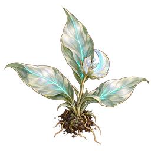

# 08_adventure_objects — Prototype 생성 결과

생성 파일이며 게임 적용 QA는 미완료. 04_images는 초기 테스트 규격, 05_sources는 생성 원본. 리사이즈는 종횡비 유지(투명 개체는 contain, 불투명 배경은 cover). 크기 일치는 미술·알파·애니메이션 합격을 의미하지 않는다.

## OBJ01 조사_식물_시듦

- 원본: 1214×1295 / 테스트 파일: 512×512
- 상태: generated_pending_game_qa, 샘플 알파: 0~255

## OBJ02 조사_식물_회복

- 원본: 1254×1254 / 테스트 파일: 512×512
- 상태: generated_pending_game_qa, 샘플 알파: 0~255

## OBJ03 달빛_약초

- 원본: 1312×1199 / 테스트 파일: 256×256
- 상태: generated_pending_game_qa, 샘플 알파: 0~255

## OBJ04 사건_룬_비활성

- 원본: 1254×1254 / 테스트 파일: 512×512
- 상태: generated_pending_game_qa, 샘플 알파: 0~255

## OBJ05 사건_룬_활성

- 원본: 1254×1254 / 테스트 파일: 512×512
- 상태: generated_pending_game_qa, 샘플 알파: 0~255

## 회복 식물 v2
잎 자세·개화 개선. 화분 문양·위치의 고정은 미완료하여 검수용 후보로 저장.
