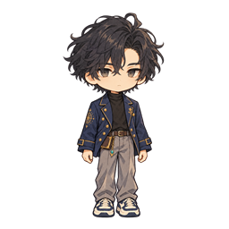
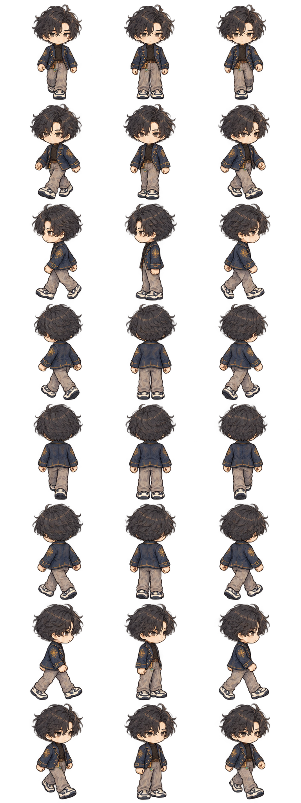

# 09_sd_character — Prototype 생성 결과

생성 파일이며 게임 적용 QA는 미완료. 04_images는 초기 테스트 규격, 05_sources는 생성 원본. 리사이즈는 종횡비 유지(투명 개체는 contain, 불투명 배경은 cover). 크기 일치는 미술·알파·애니메이션 합격을 의미하지 않는다.

## SD01 카엘_기준

- 원본: 1254×1254 / 테스트 파일: 256×256
- 상태: generated_pending_game_qa, 샘플 알파: 0~255

## SD02 카엘_걷기_마스터

- 원본: 768×2048 / 테스트 파일: 768×2048
- 상태: generated_pending_game_qa, 샘플 알파: 0~254

