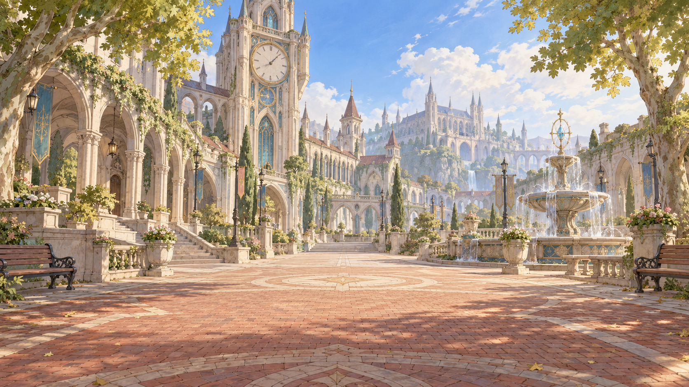
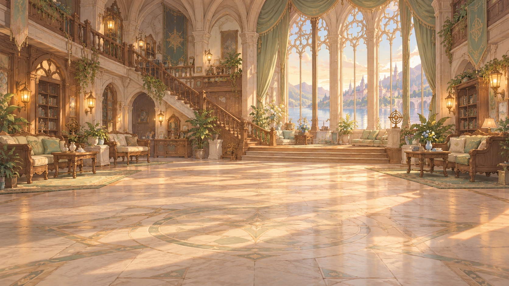
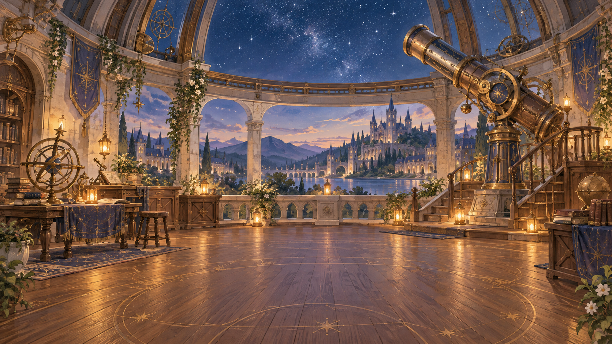
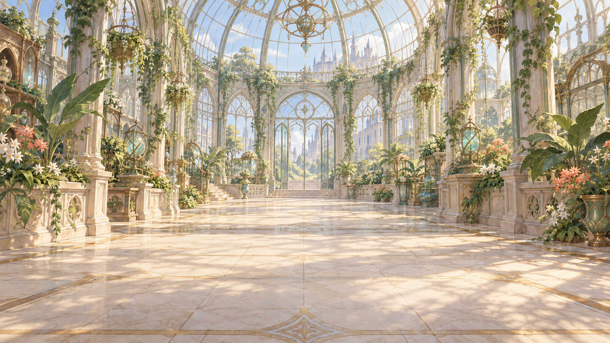
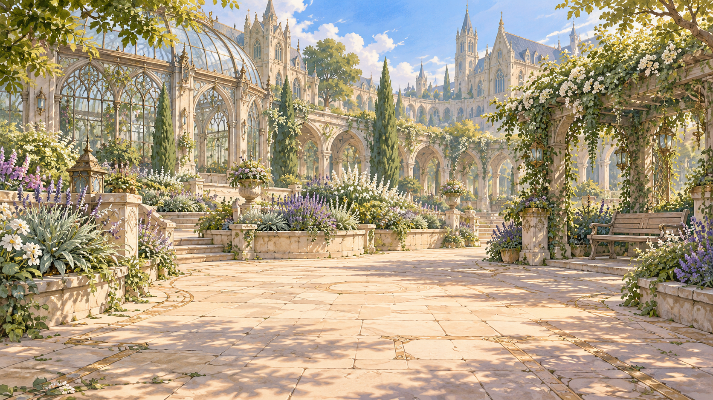

# 아르카디아 배경 원화 10종

2026-09-30 · 내장 이미지 생성 도구로 장소별 한 장씩 생성. 기준: 세계관 문서와 lumia-chronicles 공통 에셋·톤 규격. 인물·UI 없는 가로 배경이며 기존 이미지는 보존했다.

## BG01 아르카디아 입구와 호수

1672 × 941 px · [PNG 원본](../assets/background_images/BG01_arcadia_entrance_and_lake_000.png)

## BG02 시계탑 광장

1672 × 941 px · [PNG 원본](../assets/background_images/BG02_clocktower_plaza_001.png)

## BG03 빈 마이룸

1672 × 941 px · [PNG 원본](../assets/background_images/BG03_empty_myroom_002.png)

## BG04 학원 기숙사

1672 × 941 px · [PNG 원본](../assets/background_images/BG04_academy_dormitory_003.png)

## BG05 대서고

1672 × 941 px · [PNG 원본](../assets/background_images/BG05_grand_library_004.png)

## BG06 별빛 천문대

1672 × 941 px · [PNG 원본](../assets/background_images/BG06_starlight_observatory_005.png)

## BG07 유리 온실

1672 × 941 px · [PNG 원본](../assets/background_images/BG07_glass_greenhouse_006.png)

## BG08 치유의 약초원

1672 × 941 px · [PNG 원본](../assets/background_images/BG08_healing_herb_garden_007.png)

## BG09 마도 공방

1672 × 941 px · [PNG 원본](../assets/background_images/BG09_magic_workshop_008.png)

## BG10 룬 수련장

1672 × 941 px · [PNG 원본](../assets/background_images/BG10_rune_training_ground_009.png)

## 적용 메모

- 공통 프롬프트와 장소별 DELTA는 [생성 프롬프트](production_asset_records_130.md#backgrounds_prompts_084)에 보존.
- 목표 규격은 2560×1440이나 실제 생성 크기는 위 기록을 따른다. 임의 확대·크롭은 하지 않았다.
- 마이룸은 배치용 빈 방, 기숙사는 공용 휴게실. 가구 배치 시 바닥 원근·그림자·크기 조정 필요.
- 전경은 캐릭터 합성 여백으로 확보했으나 실제 캐릭터와 대화창을 겹친 화면 검수는 미실시.
- 모든 배경은 평면 원화. 원경·중경·전경 분리, 낮/밤 변형, 물결·빛 애니메이션은 후속 작업.
- 시계탑 상단은 프레임 밖으로 이어지는 구도다. 전체 건물 안내도 용도로는 별도 원화 필요.
- 작은 화면에서 장소의 주요 구조물이 잘리지 않는지 개별 크롭 기준을 정해야 한다.

## Prototype 내보내기
원본 10장 보존, 01_exports에 1920×1080 파일 추가. 비율 유지 확대·중앙 크롭이며 새로운 고해상도 원화 아님. [목록](production_asset_records_130.md#design_legacy_export_manifest_017).
