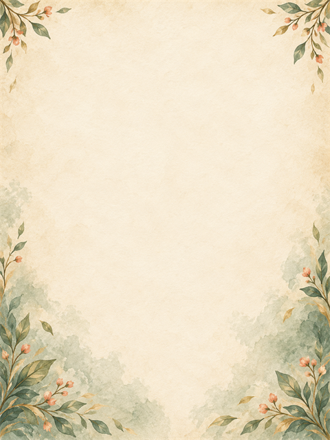
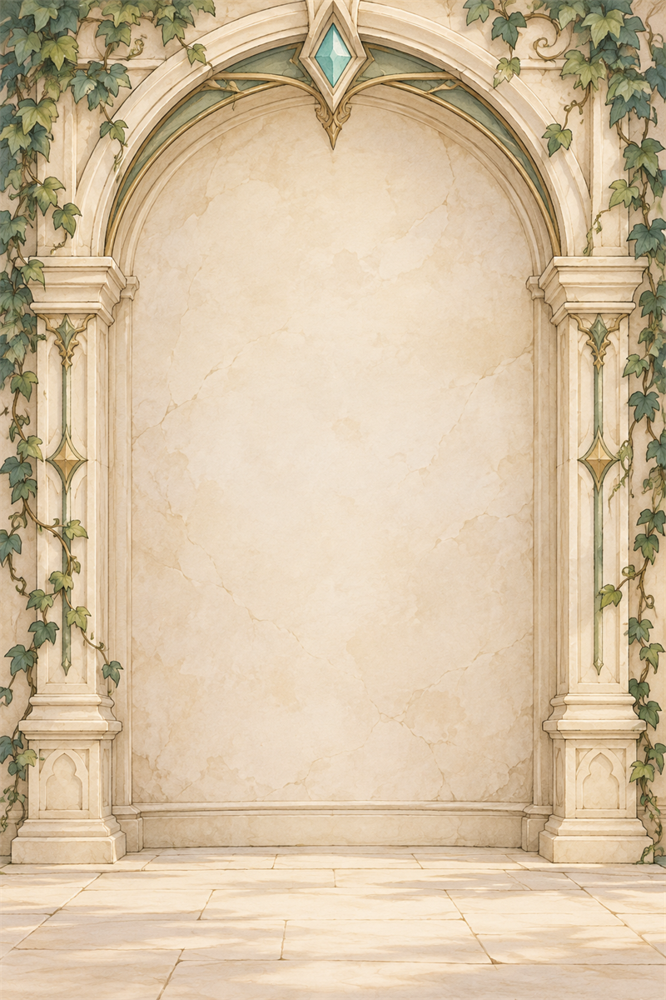
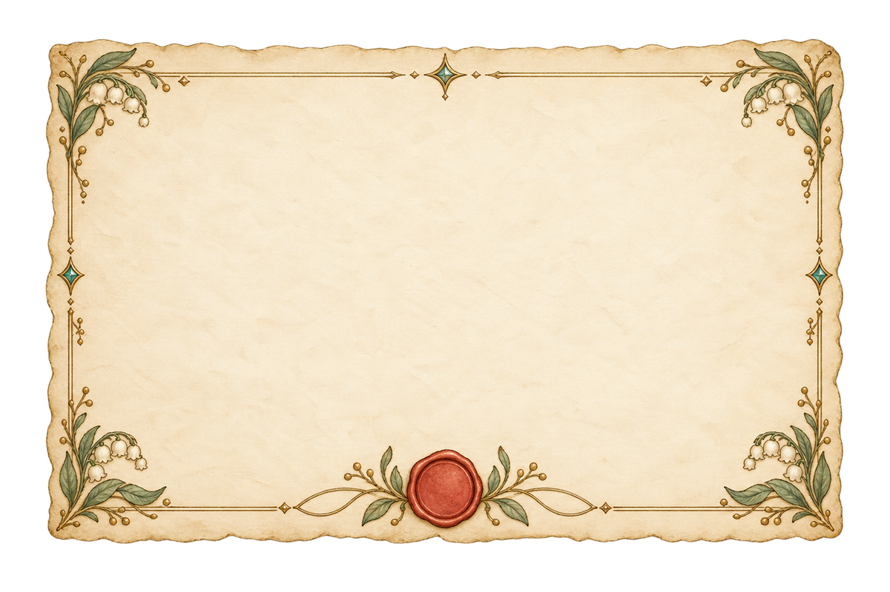

# 04_ui — Prototype 생성 결과

생성 파일이며 게임 적용 QA는 미완료. 00_images는 초기 테스트 규격, 01_sources는 생성 원본. 리사이즈는 종횡비 유지(투명 개체는 contain, 불투명 배경은 cover). 크기 일치는 미술·알파·애니메이션 합격을 의미하지 않는다.

## UI01 양피지_타일

- 원본: 1254×1254 / 테스트 파일: 512×512
- 상태: generated_pending_game_qa, 샘플 알파: 255~255

## UI02 프레임_모서리

- 원본: 1254×1254 / 테스트 파일: 192×192
- 상태: generated_pending_game_qa, 샘플 알파: 0~255

## UI03 캐릭터_카드_배경

- 원본: 1086×1448 / 테스트 파일: 480×640
- 상태: generated_pending_game_qa, 샘플 알파: 255~255

## UI04 전신_미리보기_배경

- 원본: 1024×1536 / 테스트 파일: 800×1200
- 상태: generated_pending_game_qa, 샘플 알파: 255~255

## UI07 입학_초대장

- 원본: 1536×1024 / 테스트 파일: 1200×800
- 상태: generated_pending_game_qa, 샘플 알파: 0~255

## UI07 재검수 정정
초대장에는 넓은 후광이 보이지 않고 외곽 2px 알파 최대값 0. 세부 가장자리 게임 합성 QA는 별도. 재생성하지 않음.
