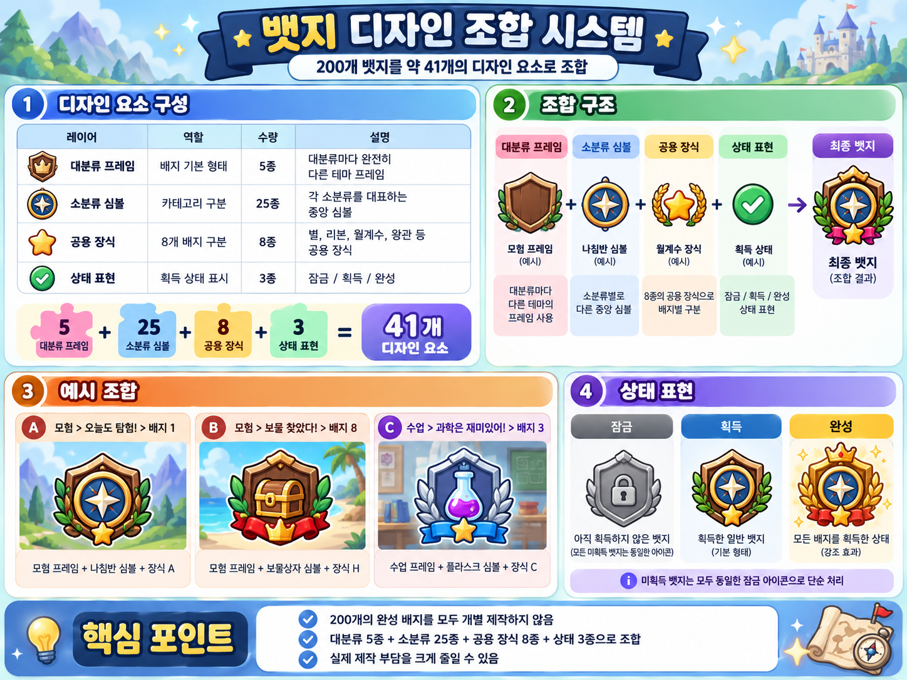

# 가방 수집 배지 분류·디자인 시스템

## 1. 기본 수량

가방의 수집 배지는 다음 구조를 기본안으로 사용합니다.

| 항목           |  수량 | 구성                     |
| -------------- | ----: | ------------------------ |
| 대분류         |   5개 | 서로 다른 큰 테마·프레임 |
| 소분류         |  25개 | 대분류당 5개             |
| 실제 배지      | 200개 | 소분류당 8개             |
| 단계 보상 지점 |  75개 | 소분류마다 3단계 보상    |

구조는 `5개 대분류 × 5개 소분류 × 8개 배지 = 총 200개 배지`입니다.

## 2. 디자인 제작 원칙

200개의 배지를 각각 완전히 별개의 일러스트로 만들지 않고, **공통 디자인 요소를 조합하는 방식**으로 제작 부담을 줄입니다.

| 디자인 레이어  | 수량 | 역할                           | 적용 방식                                                 |
| -------------- | ---: | ------------------------------ | --------------------------------------------------------- |
| 대분류 프레임  |  5종 | 배지의 큰 형태와 분위기        | 대분류마다 완전히 다른 프레임·테마 사용                   |
| 소분류 심볼    | 25종 | 어떤 소분류인지 구분           | 배지 중앙의 대표 심볼로 사용                              |
| 공용 배지 장식 |  8종 | 한 소분류 안의 8개 배지를 구분 | 별·리본·월계수·왕관 등 공용 장식을 모든 소분류에서 재사용 |
| 상태 표현      |  3종 | 잠금·획득·완성 상태 표현       | 모든 배지에 공통 적용                                     |

따라서 기본 디자인 요소는 `5 + 25 + 8 + 3 = 약 41종`으로 구성합니다.

완성 배지 하나는 다음 조합으로 만들어집니다.

`대분류 프레임 + 소분류 심볼 + 8종 중 하나의 공용 장식 + 상태 표현`

예시:

- `모험 프레임 + 나침반 심볼 + 장식 A`
- `모험 프레임 + 보물상자 심볼 + 장식 H`
- `수업 프레임 + 플라스크 심볼 + 장식 C`

## 3. 미획득 배지 표현

미획득 배지는 개별 배지 디자인을 미리 노출하지 않고 **하나의 통일된 잠금 아이콘**으로 단순하게 표시합니다.

- 기본안: 열쇠 또는 자물쇠 형태의 공통 아이콘 1종
- 대분류·소분류·배지별 미획득 실루엣은 별도로 제작하지 않음
- 획득하는 순간 실제 조합 배지 디자인을 공개

이를 통해 잠긴 배지 200개에 대한 별도 미획득 이미지를 만들 필요가 없습니다.

## 4. 배지 상태

| 상태   | 표시 방식                                                                        |
| ------ | -------------------------------------------------------------------------------- |
| 미획득 | 모든 배지에 동일한 열쇠/자물쇠 아이콘 사용                                       |
| 획득   | 대분류 프레임 + 소분류 심볼 + 공용 장식 조합을 정상 표시                         |
| 완성   | 소분류의 8개 배지를 모두 모았을 때 해당 카테고리 또는 배지 영역에 강조 효과 표시 |

완성 효과는 별도 고유 배지를 새로 그리는 방식보다 광택·별·리본·테두리 강조 등 공통 효과를 재사용하는 것을 기본으로 합니다.

## 5. 디자인 조합 이미지

아래 이미지는 200개 배지를 약 41개의 공통 디자인 요소로 조합하는 기준을 시각화한 기획 참고 이미지입니다.

## 6. 현재 확정 범위와 추후 작업

현재 기준으로 다음 구조를 사용합니다.

- 대분류 5개
- 대분류마다 소분류 5개, 총 25개
- 소분류마다 배지 8개, 총 200개
- 소분류마다 3단계 보상, 총 75개 보상 지점
- 디자인은 200개 완전 개별 제작이 아니라 조립형 시스템 사용
- 미획득 배지는 통일된 열쇠/자물쇠 아이콘으로 처리

다음 단계에서 결정할 내용은 **5개 대분류명, 25개 소분류명, 각 소분류에 들어갈 8개 실제 배지 획득 조건**입니다.
