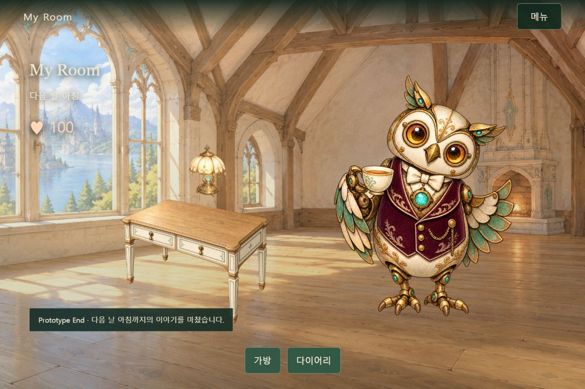

# PC Prototype v2 검증 — 2026-10-05

## 최신 반응형 수정 검증 — 2026-10-05

- 자동 테스트 39개 통과: 기존 29개 회귀 조건과 Intro 종료/실패 fallback, range 요청, 카드 drag/keyboard 구분, joystick 정규화, viewport 제한, 이전 맵 좌표의 1회 이전, 새 UI 렌더링을 포함한다.
- 사용자 저장을 건드리지 않도록 별도 4174 주소에서 새 이야기부터 검증했다. Desktop 1280×720 및 모바일 viewport 375×667을 사용했다. 실제 iPhone 6s/물리 터치 기기 성능 검증은 범위가 아니다.
- 실제 영상 재생/자동 종료, 타이틀 돌아가기/Skip, 저장 후 Intro→이어하기, 32명 카드 탐색과 내부 + 확대, 원본 개인화 초대장, 고정 좌우 대화와 클릭 진행을 확인했다.
- MAP04의 일부를 보여 주는 mobile camera/joystick 이동, Desktop↔mobile viewport 전환, 흙/햇빛/룬 조사와 Knowledge HUD, 약초 Item, stop/resume, 실제 회전 퍼즐과 회복 overlay를 확인했다.
- 회복 꽃을 재조사하지 않고 입구에서 시온 대화로 돌아왔다. 중앙 Desktop Choice와 Dialogue 위 Mobile Choice, 선택한 문장의 Player 발화, NPC 반응을 확인했다.
- Reflection ‘시온에게 말을 건넨 순간’, Heart Record/다이어리 저장, 완료 ♥ +100, My Room compact ♥100, Bern Small Choice 후 자동 다이어리 열림/추가 보상 없음, 하루 마무리를 확인했다.
- 원본 MAP04 6,681,438→WebP 552,362 bytes, Intro 7,614,866→무음 960×540/24fps MP4 1,339,961 bytes. 32개 thumbnail 총 520,088 bytes. Life portrait/배경도 WebP 파생본을 사용한다. 원본 PNG/MP4는 보존한다.
- 새 브라우저 검증 이미지: choice-desktop-2026-10-05.jpg, choice-mobile-2026-10-05.jpg.
- Day02 아침의 다이어리에 실제 선택과 기억이 남고, 새로고침→Intro/Skip→이어하기 후 다음 날 아침/♥100을 유지했다. 이 검증 세션의 error/warn 로그는 없었다. 최종 모듈 문법 검사와 git diff --check 통과.

### 남은 확인

[TBD] 최종 회복 맵/표정/시간대 자산, 다음 날 방 나가기 등 기존 미확정 항목 보존. [개발 확인] 실제 배포 브라우저의 코덱/메모리/오프라인/접근성, 정밀 collision 좌표 조정, 실제 멀티터치. [Playtest 확인] 맵 동선/SD 크기/카메라/긴 선택/터치 조작감, Rune 직행 Soft Guidance 필요 여부. [Prototype 제외] 소리·백엔드·로그인·서버 저장·보호자 UI·전투·새 Tile 엔진·Episode2·전체 SD·Theme 구매.

아래는 수정 전 v2 검증 기록이며 최신 화면의 증거로 혼용하지 않는다.

## 자동 검증

- Node 테스트 29개 통과, 실패 0개: 상태 전이, 32명 카드/카엘만 선택, Knowledge/Item 분리, 퍼즐 연결과 경계, 선택별 동일 보상·중복 방지, 다이어리 선행 조건, 선택적 채집/재조사, 로컬 저장 실패/정확한 재시도, v1 보존, Bern Small Choice 비저장, 화면 문구와 입력 일시정지.
- prototype의 JavaScript 모듈 문법 검사와 git diff --check 통과.
- 재사용 원본 에셋 76개 SHA-256 일치. 별도 임시 발렌티누스 컷아웃은 원본 비교 대상이 아님.

## 실제 브라우저 플레이

앱 내 브라우저(1066×708)에서 새 이야기부터 Day 2 아침까지 완료했습니다.

- 룬/타이틀 → 남녀 16명씩 카드 탐색 → 다른 인물 상세·확대(시작 버튼 없음) → 카엘 선택 → 입학 → 광장과 두 인물 대화 → 온실/Adventure.
- 키보드 이동/E 조사, 사실 발견 순서, 약초의 가방 수집, 햇빛 조사, 룬 조사, 3단계 힌트와 실제 조각 회전/자동 완료를 확인했습니다.
- 탐험 중 새로고침/이어하기, 메뉴의 잠시 쉬기/Life/탐험 재진입을 확인했습니다.
- 회복된 꽃을 재조사하지 않고 입구에서 시온의 대화로 돌아갔습니다.
- 주요 선택은 ‘시간’ 분기로 실제 플레이했습니다. 실제 플레이어 발화 → 반응 → 저녁 방 → Reflection ‘듣기’ → 기록 → 다이어리 저장 → 100 Heart → 안내 → 자유 시간까지 확인했습니다.
- 베른 대화 ‘오늘 일을 생각하기’ 분기 후 다이어리가 자동으로 열리지 않았습니다. 같은 저녁 반복 대화와 새로고침 후 짧은 재대화도 확인했습니다.
- 하루 마무리 → 다음 날 아침 → 가방 약초 1개/실제 선택·기억이 담긴 다이어리 → 새로고침/이어하기를 확인했습니다. 100 Heart를 유지하고 종료 연출은 재생하지 않았습니다.
- 해당 플레이의 브라우저 error/warn 로그는 없었습니다.

다른 주요 선택·Small Choice 분기의 데이터/상태/화면은 자동 테스트로 확인했으며 모든 분기를 브라우저에서 각각 완주한 것은 아닙니다. 저장 거부와 재시도 입력 복구는 자동 테스트로 확인했으며 실제 브라우저 저장 용량 초과를 유발한 검증은 아닙니다.

## 검증 중 수정

초기 타이틀의 잘못된 이어하기 표시, Adventure 메뉴의 클릭 차단, 저장 재시도 성공 후 입력 일시정지 잔류, 회복 후 Life 재진입 시 시든 꽃 대사 재생을 수정했습니다. 별도 코드 검토에서 지적된 입력 복구 문제를 회귀 테스트에 포함했습니다.

## 남은 확인과 범위

이 결과는 디자인 승인이나 실제 아동 사용자 테스트가 아닙니다. 발렌티누스 컷아웃 가장자리, 보행·인물 외곽·화분 정렬, 최종 모드별 배경/연출은 디자이너 교체 및 QA 대상입니다.

저사양 실물 PC, 태블릿, 여러 브라우저, 장시간 성능, 오디오와 접근성 전체 검증은 하지 않았습니다. 클릭 이동에는 자동 길찾기가 없습니다.

백엔드·로그인·API·서버 저장·부모 리포트는 구현하지 않았습니다. 이어하기는 같은 브라우저/origin에서만 유지됩니다. 현재 작업은 dev-ds의 로컬 변경이며 이번 수정은 커밋·푸시하지 않았습니다.
